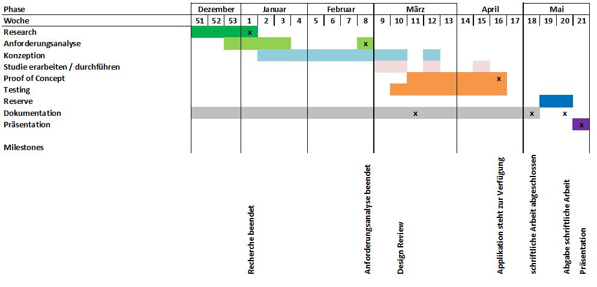

\newpage

#Projektmanagement
In diesem Kapitel wird die Planung der Bachelorarbeit ausgeführt. Weiter wird die verwendete Infrastruktur erläutert.

##Grobe Projektplanung
Der grobe Projektplan illustriert die Strukturierung der Bachelorarbeit über die knapp sechs Monate lange Projektzeit. Der Projektplan liefert einen generellen Überblick über den zeitlichen Ablauf der Bachelorarbeit und legt die Milestones fest.
Als Soll-Aufwand der Bachelorarbeit wurden 376  Stunden veranschlagt. Der effektive Aufwand betrug xx Stunden.

<!--TODO Anzahl Stunden xx einsetzen-->

\newpage

##Aufwand
Im Unterkapitel [Rahmenbedingungen Bachelorarbeit] wurde bereits aufgeführt, dass eine Bachelorarbeit laut Regelement mindestens 360 Stunden betragen soll. Diese Rahmenbedingung wurde bei der Aufgabenstellung und Aufwandschätzung der Bachelorarbeit berücksichtigt.

-------------------------------------------------------------------------------
__Arbeitsschritt__           __Soll__            __Ist__
--------------------------- -------------------- ------------------------------
Initialisierung             10                   

Recherche                   45                   

Analyse                     20                   

Konzeption                  80                   

Prototyp                    60                   

Dokumentation               140                  

Abgabe                      20                   

__Total__                   __375__              __xx__
-------------------------------------------------------------------------------
Table: Soll/Ist Analyse

\newpage
##Meilensteine
Meilensteine sind zum einen sehr wichtig für das Projektmanagement, da sie den gesamten Ablauf der Bachelorarbeit in mehrere kleine und überschaubarere Etappen und Zwischenziele einteilen. Dadurch kann auf dem Weg zur erfolgreichen Umsetzung der Bachelorarbeit immer wieder Inne gehalten und kontrolliert werden, wie der Stand der Dinge ist und ob die Richtung geändert werden muss. So bleibt stets der Überblick gewahrt und das Projekt "Bachelorarbeit" gerät nicht ausser Kontrolle. [^meilenstein]

------------------------------------------------
__Ende Meilstein__     		__Meilenstein__           
--------------------------- --------------------
bis 10. Januar 2016         Recherche beendet

bis 28. Februar 2016		Anforderungsanalyse beendet

bis 20. März 2016			Design Review

bis 24. April 2016			Applikation steht zur Verfügung

bis 8. Mai 2016				schriftliche Arbeit abgeschlossen

bis 22. Mai 2016			Abgabe schriftliche Arbeit

bis 29. Mai 2016			Präsentation                       
------------------------------------------------
Table: Meilensteine

[^meilenstein]: [@meilensteine]

\newpage

##Termine

------------------------------------------------
__Datum__   __Termin__           
----------- ------------------------------------
28.10.2015	Besprechung Aufgabenstellung mit Betreuer

18.11.2015	Freigabe der Aufgabenstellung

9.12.2015	Kichkoff

6.01.2016	Statusmeeting mit Betreuer

<!--TODO-->	Statusmeeting mit Betreuer
							
<!--TODO-->	Statusmeeting mit Betreuer
							
<!--TODO-->	Statusmeeting mit Betreuer

<!--TODO-->	Designreview

<!--TODO-->	Statusmeeting mit Betreuer

<!--TODO-->	Abgabe schriftliche Arbeit

<!--TODO-->	Präsentation                       
------------------------------------------------
Table: Termine der Bachelorarbeit

\newpage

##Infrastruktur
Im Unterkapitel "Infrastruktur" sollen die verwendeten Tools erläutert werden.

###Quellcode-Verwaltung mit GitHub
Um einerseits eine Datensicherung zu gewährleisten und anderseits die Änderungen nachvollziehbar abzulegen, wird die Bachelorarbeit mittels Git und GitHub versioniert. Das Repository [^gitrepository] ist für den Betreuer, Experten und Auftraggeber jederzeit einsehbar.

###Zeitmanagement mit toggl
Beim Arbeiten an der Bachelorarbeit kann man sich schnell in Details verlieren. Das Zeitmanagement-Tool toggl[^toggl] gibt schnell ein Feedback zur aktuell gebrauchten Zeit und einen Überblick um die geplante mit der real verwendeten Zeit zu vergleichen.Die Software ist besonders unter Kreativagenturen und Freelancern beliebt. Sie präsentiert sich als eine besonders simple Lösung, die die flexible Zeiterfassung in den Fokus stellt. Der User kann neue Aufgaben mit nur einem Klick anlegen und die Stoppuhr starten, um Arbeitszeiten automatisch zu erfassen.
<!--TODO Screenshot-->

###Dokumentieren mit Pandoc und LaTex
Die Thesis dieser Bachelorarbeit soll basierend auf anerkannten wissenschaftlichen Formaten erzeugt werden. Im Intranet der ZHAW wird die Erstellung von wissenschaftlichen Arbeiten mit LaTex empfohlen. LaTex Templates der einzelnen Abteilungen können erworben werden. Die Effizienz bei der Erstellung von LaTex arbeiten ist umstritten. Diese Arbeit wird zuerst im Markdown Syntax geschrieben und mittels Pandoc in LaTex umgewandelt. Basierend auf den Templates und Einstellungen in reinem LaTex wird dann das endgültige PDF-Dokument generiert.

###Design Mockup Balsamiq
Der Auftraggeber wünscht, dass eine strukturelle Vorlage des Designs vor der Umsetzung illustriert wird. Dafür stellt der Auftraggeber eine Lizenz des Tools Balsamiq zur Verfügung. Balsamiq ist ein wireframing Tool. Dank den vielen konfigurierbaren Elementen kann rasch ein Design-Mockup von Webseiten erstellt werden.

\newpage

###yUML
Um Ablaufe-Diagramm, Use Case-Diagramme und andere Uml-Diagramme zu visualisieren, bedarf es ein Tool, dass die Diagramme sowohl optisch ansprechend wie aber auch einfach und schnell anpassbar umsetzt. yUML ist ein gratis Online-Service, über welchen mittels Code ein UML-Diagramm kreiert werden kann. Diese Art von UML designen ist daher sehr strukturiert und nachvollziehbar. Der Code, welcher zum Diagramm führt, kann so einfach als Textdatei abgespeichert werden und wird in dieser Bachelorarbeit im Github-Repository hinterlegt.

###Draw.io
Alle Diagramme, welche nicht via yUML designt werden können, werden mit dem Online Tool Draw.io erstellt. Draw.io wird in Entwicklerkreisen als webbasiertes Visio gehandelt. Seit dem letzten Release ist Draw.io ohne Einschränkung gratis verwendbar. Die gezeichneten Diagramme können direkt im Daten-Cloud Dienst Google Drive gespeichert werden.

<

<!-- TODO Continous Integration?-->

[^gitrepository]: https://github.com/coffeefan/bachelorarbeit
[^toggl]: https://toggl.com

