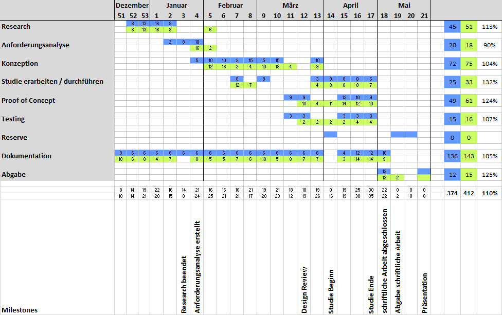

\newpage

#Projektmanagement
In diesem Kapitel wird die Planung der Bachelorarbeit durchgeführt. Weiter wird die verwendete Infrastruktur erläutert.

##Projektplan
Der grobe Projektplan illustriert die Strukturierung der Bachelorarbeit über die knapp sechs Monate lange Projektzeit. Der Projektplan liefert einen generellen Überblick über den zeitlichen Ablauf der Bachelorarbeit und legt die Milestones fest.
Als Soll-Aufwand der Bachelorarbeit wurden 374  Stunden veranschlagt. Der effektive Aufwand betrug 412 Stunden.

\newpage

##Soll - Ist Analyse/Vergleich
Im Unterkapitel [Rahmenbedingungen Bachelorarbeit] wurde bereits aufgeführt, dass eine Bachelorarbeit laut Regelement mindestens 360 Stunden betragen soll. Diese Rahmenbedingung wurde bei der Aufgabenstellung und Aufwandschätzung der Bachelorarbeit berücksichtigt.

---------------------------------------------------------------------
__Arbeitsschritt__           __Soll__            __Ist__
--------------------------- -------------------- --------------------
Recherche                   45                   51

Anforderungsanalyse         20                   18

Konzeption                  72					 75                  

Studie erarbeiten / 		25					 33
durchführen

Proof of Concept			49					 61

Testing						15					 16

Dokumentation               136					 143                 

Abgabe						12					 15
                                       

__Total__                   __376__              __412__
---------------------------------------------------------------------
Table: Soll - Ist Analyse/Vergleich

\newpage
##Meilensteine
Meilensteine sind sehr wichtig für das Projektmanagement, da sie den gesamten Ablauf der Bachelorarbeit in mehrere kleine und überschaubarere Etappen und Zwischenziele einteilen. Dadurch kann auf dem Weg zur erfolgreichen Umsetzung der Bachelorarbeit immer wieder innegehalten und kontrolliert werden, wie der Stand der Dinge ist und ob die Richtung geändert werden muss. So bleibt stets der Überblick gewahrt und das Projekt "Bachelorarbeit" gerät nicht ausser Kontrolle. [^meilenstein]
                 
------------------------------------------------------
__Datum__    	 __Meilenstein__           
---------------- -------------------------------------
24. Januar 2016  Recherche beendet
                 
31. Januar 2016	 Anforderungsanalyse erstellt
                 
30. März 2016	 Design Review
                 
10. April 2016	 Studie Beginn
                 
24. April 2016	 Studie Ende
                 
8. Mai 2016		 schriftliche Arbeit abgeschlossen
                 
11. Mai 2016	 Abgabe schriftliche Arbeit
                 
25. Mai 2016	 Präsentation                       
------------------------------------------------------
Table: Meilensteine

[^meilenstein]: [@meilensteine]

##Termine
Folgend sind die wichtigsten Termine dieser Bachelorarbeit aufgelistet.

------------------------------------------------------
__Datum__   __Termin__           
----------- ------------------------------------------
28.10.2015	Besprechung Aufgabenstellung mit Betreuer

18.11.2015	Freigabe der Aufgabenstellung

9.12.2015	Kick Off

11.05.2016	Abgabe schriftliche Arbeit

25.05.2016	Präsentation                       
------------------------------------------------------
Table: Termine der Bachelorarbeit

\newpage

##Infrastruktur
Im Unterkapitel "Infrastruktur" sollen die verwendeten Werkzeuge erläutert werden.

###Quellcode-Verwaltung mit GitHub
Um einerseits eine Datensicherung zu gewährleisten und anderseits die Änderungen nachvollziehbar abzulegen, wird die Bachelorarbeit mittels Git versioniert. Der Quellcode wird auf github.com verwaltet. Das Repository [^gitrepository] ist öffentlich jederzeit einsehbar.

###Zeiterfassung mit toggl
Das Zeitmanagement-Tool toggl[^toggl] gibt schnell ein Feedback zur aktuell gebrauchten Zeit und einen Überblick, um die geplante mit der real verwendeten Zeit zu vergleichen. Die Software ist besonders unter Kreativagenturen und Freelancern beliebt. Sie präsentiert sich als eine besonders simple Lösung, die die flexible Zeiterfassung in den Fokus stellt. Der User kann neue Aufgaben mit nur einem Klick anlegen und die Stoppuhr starten, um Arbeitszeiten automatisch zu erfassen.
<!--TODO Screenshot-->

###Dokumentieren mit Pandoc und LaTex
Die Thesis dieser Bachelorarbeit soll basierend auf anerkannten, wissenschaftlichen Formaten erzeugt werden. Im Intranet der ZHAW wird die Erstellung von wissenschaftlichen Arbeiten mit LaTex empfohlen. LaTex Templates der einzelnen Abteilungen können erworben werden. Die Effizienz bei der Erstellung von LaTex Arbeiten ist umstritten. Diese Arbeit wurde zuerst im Markdown Syntax geschrieben und mittels Pandoc in LaTex umgewandelt. Basierend auf den Templates und Einstellungen in reinem LaTex wurde dann das endgültige PDF-Dokument generiert.

###Tools für Grafik
####Design Mockup Balsamiq
Der Auftraggeber wünscht, dass eine strukturelle Vorlage des Designs vor der Umsetzung illustriert wird. Dafür stellt der Auftraggeber eine Lizenz des Tools Balsamiq zur Verfügung. Mit dem Wireframing-Tool Balsamiq kann, dank den vielen konfigurierbaren Elementen, rasch ein Design-Mockup von Webseiten  oder Applikationen erstellt werden.

\newpage

####yUML
Um Ablaufe-Diagramm, Use Case-Diagramme und andere UML-Diagramme zu visualisieren, bedarf es eines Tools, dass die Diagramme sowohl optisch ansprechend, wie aber auch einfach und schnell anpassbar umsetzt. yUML ist ein gratis Online-Service, über welchen mittels Code ein UML-Diagramm kreiert werden kann. Diese Art von UML-Gestaltung ist daher sehr strukturiert und nachvollziehbar. Der Code, welcher zum Diagramm führt, kann so einfach als Textdatei abgespeichert werden und wird in dieser Bachelorarbeit im Github-Repository hinterlegt.

<!---->

####Draw.io
Alle Diagramme, welche nicht via [yUML] designed werden können, werden mit dem Online Tool Draw.io erstellt. Draw.io wird in Entwicklerkreisen als webbasiertes Visio gehandelt. Seit dem letzten Release ist Draw.io ohne Einschränkung gratis verwendbar. Die gezeichneten Diagramme können direkt im Daten-Cloud Dienst Google Drive gespeichert werden.

###Infrastruktur Entwicklung
Die Infrastruktur, welche zur Entwicklung verwendet wird, kann je nach Anforderung und Konzeption variieren. Die verwendete Infrastruktur wird deshalb nach der Definition und Konzeption im Kapitel [Entwicklungswerkzeuge] aufgelistet.

<!-- TODO Continous Integration?-->

[^gitrepository]: https://github.com/coffeefan/bachelorarbeit
[^toggl]: https://toggl.com

