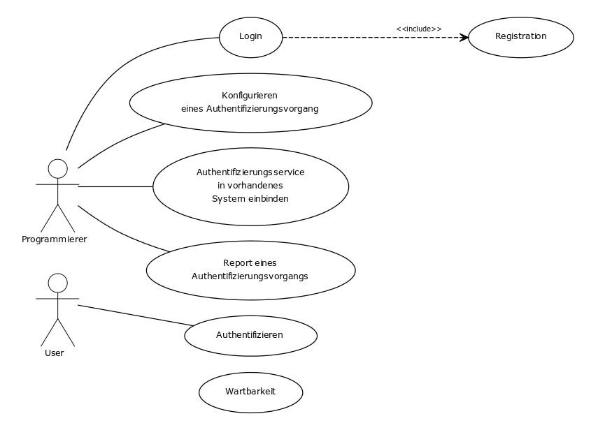

#Anforderungen
Dieses Kapitel beschreibt das Durchführen einer Anforderungsanalyse festgehalten. Anhand der Anforderungsanalyse sollen die Anforderungen für die entwickelnden Software ermittelt werden. Die Anforderungen bilden die Basis für die Architektur, das Softwaredesign, die Implementationund die Testfälle. Ihnen ist dem entsprechend ein sehr grosser Stellenwert zuzuschreiben.

##Akteure
__Programmierer__
Der Programmierer ist der Entwickler der Webseite. Er möchte sein programmiertes oder sein verwendetes Social-Media Modul mit dem Authentifizierungsschnittstellen-Service schützen.

__User__
Der User ist der Endkunde. Er nimmt am Social-Media Modul teil und authentifiziert sich über den Authentifizierungsschnittstellen-Service

\newpage

##Use-Cases
Im Nachfolgenden werden alle UseCases aufgelistet die im Rahmen dieser Thesis gefunden wurden.

###Use-Cases Diagramm

Das Use-Case Diagramm illustriert die nachfolgenden Use Cases. Dadurch kann rasch ein Überblick über die zu entwickelnde Lösung geschaffen werden.

\newpage

###Use-Cases Beschreibung
Die im Diagramm dargestellten Use-Cases werden nun noch beschrieben. Die Use-Cases wurden nummerisch nach Themenbereichen gruppiert.

#### UC-11 Registration für den Konfigurator

-------------------------------------------------------------------------------
__UseCase__
--------------------------- --------------------------------------------------
__Ziel__                    Ein Programmierer ist am Authentifizierungsschnittstellen-Service registrieren

__Beschreibung__           	Ein Programmierer muss sich am Authentifizierungsschnittstellen-Service registrieren können

__Akteure__                 Programmierer

__Vorbedingung__            Keine

__Ergebnis__                Registrierter Programmierer

__Hauptszenario__           Der Programmierer füllt ein Registrationsformular aus und bestätigt seine E-Mail Adresse

__Alternativszenario__      -
-------------------------------------------------------------------------------

#### UC-12 Login Konfigurator

-------------------------------------------------------------------------------
__UseCase__
--------------------------- --------------------------------------------------
__Ziel__                    Ein Programmierer kann sich beim Authentifizierungsschnittstellen-Service

__Beschreibung__           	Ein Programmierer muss sich am Authentifizierungsschnittstellen-Service authentifizieren können

__Akteure__                 Programmierer

__Vorbedingung__            Der Programmierer ist registriert.

__Ergebnis__                Authentifizierter und eigeloggter Programmierer

__Hauptszenario__           Der Programmierer loggt sich mit E-Mail und Passwort am Authentifizierungsschnittstellen-Service ein.

__Alternativszenario__      Der Programmierer sendet sich das verpasste Passwort per E-Mail zu. Erstellt über den im erhaltenden E-Mail enthaltenen Link ein neues Passwort und loggt sich mit E-mail und dem neuen Passwort am Authentifizierungsschnittstellen-Service ein.
-------------------------------------------------------------------------------

#### UC-21 Konfigurieren eines Authentifizierungsvorgang

-------------------------------------------------------------------------------
__UseCase__
--------------------------- --------------------------------------------------
__Ziel__                    Es ist eine neuer Authentifizierungsvorgang für ein neus Social Media-Modul konfiguriert

__Beschreibung__           	Der Programmierer kann ein neuer Authentifizierungsvorgang eröffnen

__Akteure__                 Programmierer

__Vorbedingung__            Der Programmierer hat sich am System angemeldet

__Ergebnis__                Neuer Authentifizierungsvorgang

__Hauptszenario__           Der Programmierer eröffnet einen neuen Authentifizierungsvorgang. Er benennt ihn sinnig. Die zu verwende(n) Authentifizierungskomponennten werden ausgewählt. Bei der Konfiguration unterstützen die Resultate die Studie den Programmierer für die optimalte Konfiguration. Am Ende der Konfiguration werden die Akzeptanzkritieren für eine erfolgreiche Authtentifizierung festgelegt.

__Alternativszenario__      Ein bestehender Authentifizierungsvorgang wird dupliziert
-------------------------------------------------------------------------------

#### UC-25 Authentifizierung in vorhandenes System einbinden

-------------------------------------------------------------------------------
__UseCase__
--------------------------- --------------------------------------------------
__Ziel__                    Die Authentifizierungsschnittstelle kann in ein (bestehendes) System eingebunden werden

__Beschreibung__           	Der Programmierer kann die Authentifizierungsschnittstelle in seinem System integrieren

__Akteure__                 Programmierer

__Vorbedingung__            Der Programmierer hat sich am System angemeldet. Der Programmierer hat ein neues Authentifizierungsvorgang konfiguriert

__Ergebnis__                Der Programmierer hat eine Möglichkeit die Authentifizierungsschnittstelle mit seinem konfigurierten Authentifizierungsvorgangs in seiner Software einzubinden

__Hauptszenario__           Der Programmierer öffnet die Einbindeseite. Es werden ihm alle Schritte zur Erfolgreichen Einbindung aufgelistet. Der Code liegt individualisiert vor. Der Programmierer kopiert den Code in sein Programm

__Alternativszenario__      -
-------------------------------------------------------------------------------

#### UC-31 User Authentifizieren

-------------------------------------------------------------------------------
__UseCase__
--------------------------- --------------------------------------------------
__Ziel__                    Der User ist authtentifiziert oder der User abgelehnt

__Beschreibung__           	Der User probiert sich über den Authentifizierungsschnittstellen-Service zu authentifizieren um an einem Social-Media Modul teilzunehmen

__Akteure__                 User

__Vorbedingung__            Der Programmierer hat den Authentifizierungsvorgang konfiguriert und in seinem System eingebunden.

__Ergebnis__                Der Authentifizierungsschnittstellen-Service authentifiziert den User oder lehnt ihn ab.

__Hauptszenario__           Der User wird vom Social Media Modul an den Authentifizierungsschnittstellen-Service weitergeleitet. Der User authentifziert sich. Der User kann die Eingabe des Social Media Modul erfolgreich abschliessen

__Alternativszenario__      Der User wird vom Social Media Modul an den Authentifizierungsschnittstellen-Service weitergeleitet. Der User wird vom System abgelehnt. Der User kann die Eingabe des Social-Media Modul nicht erfolgreich abschliessen.
-------------------------------------------------------------------------------

#### UC-41 Report eines Authentifizierungsvorgangs

-------------------------------------------------------------------------------
__UseCase__
--------------------------- --------------------------------------------------
__Ziel__                    Die Verwendung des Authentifizierungsvorgangs ist übersichtlich dargestellt

__Beschreibung__           	Um den Verwendung des Authentifizierungsvorgangs auszuwerten soll ein Report erstellt werden

__Akteure__                 Programmierer

__Vorbedingung__            Der Programmierer hat sich am System angemeldet. Der Programmierer hat ein neues Authentifizierungsvorgang konfiguriert. (Der Authentifizerungsvorgang ist eingebunden und verwendet worden)

__Ergebnis__                Report eines Authentifizierungsvorgangs

__Hauptszenario__           Nach Beenden eines Quizes, Votings, Wettbewerbs logt sich der Programmierer im System ein und generiert einen automatisierten Report um die Verwendung des Authentifizierungsvorgangs auszuwerten.

__Alternativszenario__      Um den Zwischenstand deines Quizes, Votings, Wettbewerbs auszuwerten logt sich der Programmierer im System ein und generiert einen automatisierten Report um die Verwendung des Authentifizierungsvorgangs auszuwerten.
-------------------------------------------------------------------------------

#### UC-51 Wartbarkeit des Authentifizierungsservices

-------------------------------------------------------------------------------
__UseCase__
--------------------------- --------------------------------------------------
__Ziel__                    Der Authentifizierungsschnittstellen-Service soll mit geringen Aufwand angepasst werden können.

__Beschreibung__           	

__Akteure__                 Entwicklungsteam-Mitglied

__Vorbedingung__            Das Entwicklungsteam-Mitglied hat Zugriff auf das Entwicklungs-Repository, Testsystem und Livesystem

__Ergebnis__                Die Anpassung ist integriert

__Hauptszenario__           Dank eingehaltenen Coderichtlinien ist es einfach möglich die Anpassung einzupflegen

__Alternativszenario__      -
-------------------------------------------------------------------------------

\newpage

##Anforderungen
Die Anforderungen sollen basierend auf der Satzschablone erstellt werden. Ziel ist sprachliche Missverständnisse dadurch zu vermeiden. Die Schablone fördert eine syntaktische Eindeutigkeit der Anforderungen und eine optimalen Zeit- und Kostenrahmen für die Verfassung.

###Aufbau
Die folgenden Abbildungen zeigen den Aufbau der Satzschablonen. Es wird zwischen der grundlegenden Version ohne zeitlichem oder Bedienungsorientiertem Aspekt und der Schablone mit diesen Eigenschaften unterschieden.

![Basis Schablone  *Quelle Rupp*[^rupp]](images/basis-schablone.jpg)

![Erweiterte Schablone  *Quelle Rupp*[^rupp]](images/erweiterte-schablone.jpg)

[^rupp]: Rupp Bilder sind aus dem Buch Basiswissen Requirements Engineering [@rupp]

\newpage
##Funktionale Anforderungen
Die funktionalen Anforderungen legen die Funktionen des Authentifizierungsschnittstellen-Service fest. Die Wünsche des Arbeitgebers aus <!--TODO Vorgehensschritten 1-4 (Kapitel 3.2)--> sind als Anforderungen umformuliert. Die funktionalen Anforderungen dienen als Grundlage für die Testfälle. Die Testfälle wiederum, bringen den Beweis dar, dass alle gewünschten Funktionen implementiert wurden.

Funktionale Anforderungen werden als FREQ-*Identifikation* bezeichnet

### FREQ-111			Programmierer Registration

--------------------	-----------------------------------------------------------------------------------------
__UC-Referenz__         UC-11

__Beschreibung__        Ein Programmierer kann sich an der Authentifizierungsschnittstellen-Service registrieren.

__Techn. Risiko__       Niedrig

__Business Value__     	Hoch
-----------------------------------------------------------------------------------------------------------------

### FREQ-112			Programmierer Login

--------------------	-----------------------------------------------------------------------------------------
__UC-Referenz__         UC-12

__Beschreibung__        Ein Programmierer muss sich an der Authentifizierungsschnittstellen-Service mittels E-Mail und Passwort anmelden.

__Techn. Risiko__       Niedrig

__Business Value__     	Hoch
-----------------------------------------------------------------------------------------------------------------

### FREQ-113			Programmierer Passwort vergessen

--------------------	-----------------------------------------------------------------------------------------
__UC-Referenz__         UC-11, UC-12

__Beschreibung__        Ein Programmierer kann ein Passwort per E-Mail anfordern.

__Techn. Risiko__       Niedrig

__Business Value__     	Hoch
-----------------------------------------------------------------------------------------------------------------

### FREQ-114			Programmierer Passwort ändern

--------------------	-----------------------------------------------------------------------------------------
__UC-Referenz__         UC-11, UC-12

__Beschreibung__        Ein Programmierer kann sein Passwort ändern. Dafür muss der Programmierer das alte und neue Passwort angeben.

__Techn. Risiko__       Niedrig

__Business Value__     	Hoch
-----------------------------------------------------------------------------------------------------------------

### FREQ-211			Konfigurieren einer neuen Social-Media Modul Authentifizierungsvorgang

--------------------	-----------------------------------------------------------------------------------------
__UC-Referenz__         UC-21

__Beschreibung__        Ein Programmierer kann ein neuer Authentifizierungsvoragn für sein neus Social-Media Modul erfassen.

__Techn. Risiko__       Niedrig

__Business Value__     	Sehr Hoch
-----------------------------------------------------------------------------------------------------------------

### FREQ-214			Studien Ergebnis zur Konfiguration nutzten

--------------------	-----------------------------------------------------------------------------------------
__UC-Referenz__         UC-21

__Beschreibung__        Ein Programmierer kann zur Konfiguration des Authentifizierungsvorangs die Studien-Ergebnisse visualisiert nutzen

__Techn. Risiko__       Niedrig

__Business Value__     	Mittel
-----------------------------------------------------------------------------------------------------------------

### FREQ-214			Anpassen eines Authentifizierungsvorgangs

--------------------	-----------------------------------------------------------------------------------------
__UC-Referenz__         UC-21

__Beschreibung__        Ein Programmierer kann ein neues Social-Media Modul erfassen

__Techn. Risiko__       Hoch

__Business Value__     	Mittel
-----------------------------------------------------------------------------------------------------------------

### FREQ-215			Authentifizerungs-Stufe auswählen

--------------------	-----------------------------------------------------------------------------------------
__UC-Referenz__         UC-21

__Beschreibung__        Ein Programmierer muss eine Authentifizerungs-Stufe für den Authentifizierungsvorgangs auswählen

__Techn. Risiko__       Niederig

__Business Value__     	Hoch
-----------------------------------------------------------------------------------------------------------------

### FREQ-251			Generierung von Code für einbinden in vorhandenes System

--------------------	-----------------------------------------------------------------------------------------
__UC-Referenz__         UC-25

__Beschreibung__        Ein Programmierer kann einen Code generieren lassen. Dieser Code soll ihm die Integration in sein System vereinfachen

__Techn. Risiko__       Sehr Hoch

__Business Value__     	Hoch
-----------------------------------------------------------------------------------------------------------------

### FREQ-311			Authentifizieren

--------------------	-----------------------------------------------------------------------------------------
__UC-Referenz__         UC-31

__Beschreibung__        Ein User kann isch über den Authentifizierungsschnittstellen-Service authentifizieren um am Social-Media Modul teilzunehmen. Der Authentifizierungsschnittstellen-Service authentifiziert oder lehnt den User ab.

__Techn. Risiko__       Mittel

__Business Value__     	Sehr Hoch
-----------------------------------------------------------------------------------------------------------------

### FREQ-411			Report der Authentifizierungen generieren

--------------------	-----------------------------------------------------------------------------------------
__UC-Referenz__         UC-41

__Beschreibung__        Der Programmierer kann ein Report generieren. Der Report soll die Verwendung übersichtlich darstellen.

__Techn. Risiko__       Mittel

__Business Value__     	Sehr Hoch
-----------------------------------------------------------------------------------------------------------------

\newpage
##Nicht Funktionale Anforderungen
Nicht Funktionale Anforderungen werden als FREQ-*Identifikation* bezeichnet.

### NFREQ-110			Betriebsystemunabhängigkeit

--------------------	-----------------------------------------------------------------------------------------
__UC-Referenz__         Alle

__Beschreibung__        Der Authentifizierungsschnittstellen-Service muss auf allen bekannten Betriebsystemen mit HTML5 und javascritfähigen Browser vewerdent werden können.

__Techn. Risiko__       Mittel

__Business Value__     	Sehr Hoch
-----------------------------------------------------------------------------------------------------------------

### NFREQ-115			Wartbarkeit

--------------------	-----------------------------------------------------------------------------------------
__UC-Referenz__         UC-51

__Beschreibung__        Die Wartbarkeit des sSystems soll sichergestellt werden

__Techn. Risiko__       Mittel

__Business Value__     	Mittel
-----------------------------------------------------------------------------------------------------------------

### NFREQ-120			Einfache Integration

--------------------	-----------------------------------------------------------------------------------------
__UC-Referenz__         UC-25, UC-21, UC22

__Beschreibung__        Der Authentifizierungsschnittstellen-Service soll einfach im vorhandenen System eingebunden werden können.

__Techn. Risiko__       Sehr hoch

__Business Value__     	Mittel
-----------------------------------------------------------------------------------------------------------------

### NFREQ-122			Einfache und verständliche visuelle Konfiguration

--------------------	-----------------------------------------------------------------------------------------
__UC-Referenz__         UC-25, UC-21, UC22

__Beschreibung__        Der Authentifizierungsschnittstellen-Service soll einfach und verständlich optisch konfiguriert werden können

__Techn. Risiko__       Sehr hoch

__Business Value__     	Mittel
-----------------------------------------------------------------------------------------------------------------

### NFREQ-126			Einfache und verständliche Authentifizierung

--------------------	-----------------------------------------------------------------------------------------
__UC-Referenz__         UC-31

__Beschreibung__        Der User soll einfach und verständlich optisch konfiguriert werden können

__Techn. Risiko__       Sehr hoch

__Business Value__     	Mittel
-----------------------------------------------------------------------------------------------------------------

### NFREQ-130			Performance

--------------------	-----------------------------------------------------------------------------------------
__UC-Referenz__         UC-31

__Beschreibung__        Das System soll insbesondere an der Stelle der Authentifzierung Performant sein.

__Techn. Risiko__       Sehr hoch

__Business Value__     	Mittel
-----------------------------------------------------------------------------------------------------------------

### NFREQ-132			Skalierbar

--------------------	-----------------------------------------------------------------------------------------
__UC-Referenz__         UC-31

__Beschreibung__        Das System soll eine hohe Skalierbarkeit aufweisen. 

__Techn. Risiko__       Sehr hoch

__Business Value__     	Mittel
-----------------------------------------------------------------------------------------------------------------

### NFREQ-135			Hohe Verfügbarkeit

--------------------	-----------------------------------------------------------------------------------------
__UC-Referenz__         UC-25, UC-21, UC22

__Beschreibung__        Der Authentifizierungsschnittstellen-Service soll eine Hohe Verfügbarkeit von 99.9%

__Techn. Risiko__       Hoch

__Business Value__     	Mittel
-----------------------------------------------------------------------------------------------------------------

### NFREQ-210			Programmirer kann aus Breite von verschiedenen Sicherheitsstufen auswählen

--------------------	-----------------------------------------------------------------------------------------
__UC-Referenz__         UC-25, UC-21, UC22

__Beschreibung__        Dem Programmierer stehen verschiedene Sicherheitsstufen zur Verfügung. Das Wort verschieden wurde durch folgende Aspekte mit dem Auftraggeber definiert:
						Abgeleitet von der Aufgabenstellung sind Aspekte "Mehfach-Teilnahme" und "Automatisierung" definiert worden. Beide Aspekte kann durch eine Sicherheitsstufe mehr oder weniger verhindern werden.
						Abhängig von der Interkativität ist es wirtschaftlich sinnvoll das Kosten entstehen dürfen. Deshalb sind die Höhe der Kosten ein Aspeket.
						Ein weiterer Aspekt ist der Aufwand für den Benutzer. 		

__Techn. Risiko__       Niedrig

__Business Value__     	Hoch
-----------------------------------------------------------------------------------------------------------------

### NFREQ-212			Die verwendeten Sicherheitsstufen sind in der Schweiz verbreitet

--------------------	-----------------------------------------------------------------------------------------
__UC-Referenz__         UC-25, UC-21, UC22

__Beschreibung__        Die eingesetzten Sicherheitsstufen sollten in der Schweiz verbreitet sein.			

__Techn. Risiko__       Niedrig

__Business Value__     	Hoch
-----------------------------------------------------------------------------------------------------------------

\newpage

\newpage
##Risiken
Nachfolgend sind die im Gespräch mit dem Auftraggeber gefundenen Riskiken bezüglich der Bachelorarbeit, sowie deren Auswirkungen, aufgeführt. <!-- Für die Risiken werden nur die zur Umsetzung ausgewählten Anforderungen berücksichtigt. -->

###R-01 Akzeptanz
Programmierer und insbesondere auch User, welche den Authentifizierungsschnittstellen-Service verwenden soll, sind völlig unterschiedlich. Deren unterschiedliche Ansprüche machen es schwierig, eine Lösung zu entwickeln welchen Akteuren gerecht wird.

Da der Auftraggeber sowohl die Zielgruppe Programmierer wie auch User kenn, kann er hier gezielt Feedback geben.

Die Auswirkung bei Eintritt dieses Risikos ist im Rahmen der Bachelorarbeit gering, da der Erfolg der Arbeit nicht von der tatsächlichen Verwendung im produktiven Umfeld abhängt.

###R-02 Kosten
Da es sich bei diesem Projekt um eine Bachelorarbeit handelt, besteht kein Personalkostenrisiko. Kostenpflichtige Produkte Dritter werden nicht verwendet. Einzig der Betrieb/Hosting der Bachelorarbeit verursacht Kosten. Das Kostenrisiko kann dank fixen Leistungsparameter auf ein Minimum reduziert werden.

###R-03 Überkomplexität
Es besteht die Möglichkeit, dass die Komplexität des zu entwickelnden Systems viel höher ist, als angenommen. Da die Komplexität nur zu einem gewissen Grad durch Architekturentscheide beeinflusst werden kann, muss besonderes Augenmerk auf dieses Risiko gelegt werden.

Dieses Risiko wird mit hoher Wahrscheinlichkeit eintreten.

Die Auswirkung bei Eintritt dieses Risikos ist, dass nicht der gesamte Umfang der Bachelorarbeit erarbeitet werden kann, weil zur Lösung der Komplexitätsprobleme zusätzliche Zeit benötigt wird.

###R-04 Systemumfeldänderungen
Umsysteme könnten während der Projektphase dieser Bachelorarbeit massgeblich verändert werden.

Dieses Risiko wird mit sehr geringer Wahrscheinlichkeit eintreten.

Die Auswirkung bei Eintritt dieses Risikos kann nicht abgeschätzt werden. Situativ muss dieses Risiko behandelt werden.

###R-05 Schlechte/Unzureichende Framework
Die Bachelorarbeit wird basierend auf verschiedenen Frameworks umgesetzt. Das Risiko, dass Frameworks nicht wie beschrieben funktionieren, schlecht dokumtiert oder instabil sind besteht.

Dieses Risiko wird mit mittlerer Wahrscheinlichkeit eintreten
Als Auswirkungen dieses Risikos sind Wechsel des Frameworks oder gar manuelle Entwicklungen und daraus zusätzliche nicht einschätzbare Aufwendungen nötig.

###R-06 Termineinhaltung
Der fixe Abgabetermin der Semesterarbeit gilt es einzuhalten. Das Risiko das die Arbeit verspätet abgegeben wird besteht.

Dieses Risiko wird mit geringer Wahrscheinlichkeit eintreten.
Die Auswirkung bei Eintritt dieses Risikos ist das nicht Bestehen der Arbeit.

###R-07 Auslastung
Das Projekt wird durch einen Mitarbeiter getragen. Dieser ist sowohl im Beruf wie auch privat stark ausgelastet. Der hohe schulische Aufwand kann beeinflusst werden. Mit zusätzliche Ausfälle durch Krankheit oder nicht vorhersehbaren Vorfällen muss gerechnet werden.

Das Risiko wird mit mittlerer Wahrscheinlichkeit eintreten.
Die Auswirkungen bei Eintritt dieses Risikos werden sich in der Qualität und Quantität der Arbeit wiederspiegeln.

\newpage
### Risikomatrix

![Risikomatrix [^risikomatrix]](images/excel-statistik/risikomatrix.JPG)

__Legende__

R1	Akzeptanz

R2	Kosten

R3	Überkomplexität

R4	Systemumfeldänderungen

R5	Schlechte/Unzureichende Frameworks

R6	Termineinhaltung

R7	Auslastung

###Massnahmen
Um das Zusammenspiel der verschiedenen Technologien und die daraus resultierende Komplexität einschätzen zu können wird vor Projektbeginn ein Prototyp mittels Durchstich durch alle Technologien erstellt. Danach kann die Komplexität im Zusammenspiel der Technologie eingeschätzt und bei Bedarf eine Technologie durch eine andere Ersetzt werden. So kann das Risiko 3 Überkomplexität und Risiko 5 Schlechte/Unzureichende Frameworks minimiert werden.

Das Projekt ist über eine Anzahl von Feiertagen gelegt, welche gebraucht werden könnten. Zusätzlich wurden vom Studenten eine Arbeitswoche Ferien genommen, welche im Notfall auch für die Arbeit verwendet werden könnte.  Durch diese Massnahmen sollte das Risiko 6 Termineinhaltung minimal bleiben.
Das Risiko 7 Auslastung kann nicht direkt vermindert werden. Die Aktivitäten im Bereich der freiwilligen Arbeit wurde auf ein Minimum reduziert. Für die restliche freiwilige Arbeit wurde mit Freunden ein Nofallszenario entwickelt, so kann der Student bei Bedarf seine freiwillige Arbeit durch andere Personen übernehmen lassen. Der Kontakt mit dem  mit Arbeitgeber wird intensiv gepflegt um, so bei Bedarf die Arbeitsbelastung zu vermindern. Die Massnahmen welche für Risiko 6 ergriffen wurden entschärfen auch Risiko 7.

[^risikomatrix]: Die Risikomatrix wurde basierend auf der Excel-Vorlage der Stadtpolizei Zürich Abteilung Informatik entworfen
