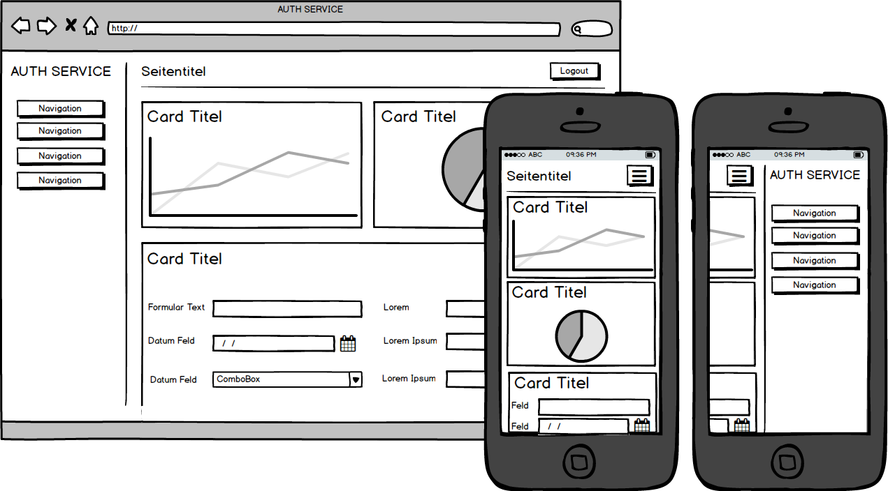

#Design der Software
In diesem Kapitel soll ein System für den Authentifizierungsservice entworfen werden. Das System soll den Anforderungen, welche im vorherigen Kapitel definiert wurden, entsprechen. 

Um die Komponenten unabhängig von einander zu entwickeln, wird bei der Entwicklung der Architektur des Authtenifizierungsservice darauf geachte möglichst gerine Kopplung aufzuweisen.

##Architektur
Der Authtentifizierungsservice besteht aus drei Hauptkomponenten: Web-API, Konfigurator und Autorisierung. Die folgende Abbildung zeigt die Verbindungen der drei Hauptkomponenten im Systemkontext des Authentifizierungservice auf.

##Mockup
Ein Mockup ist eine grobe Vorlage für die Design-Umsetzung. Es ist eine ideale Möglichkeit das visuelle Konzept ab zu bilden und mit dem Auftraggeber vorgängig anzuschauen. Die folgenden Unterkapitel bilden die Mockups der App ab.

###Konfigurator Template
Der Konfigurator soll den Programmierer visuell beim Konfigurieren und Verwalten seiner Authtenifizierungsprojekte unterstützen. Bei der Zielgruppe handelt es sich um Programmierer. Es kann deshalb von einem hohen Know-How ausgegangen werden. Die Oberfläche soll möglichst effizient gestaltet sein. Die Designelemente sollen deshalb klar und einheitlich gestaltet werden. Generell ist davon auszugehen, dass der Programmierer beim Einrichten seines Projektes am Desktop arbeitet. Für Auswertungen und Präsentationen kann der Programmierer durchaus auch mobile Endgeräte verwenden. Deshalb soll die Umsetzung responsive gestaltet werden.

####Seitenaufbau
Im Header wird der Programmierer anhand des Seitentitels gleich über seinen aktuellen Standort orientert. 

####Navigation
Im Designkonzept wurde von einer Klappmenü oder Topnavigation abgesehen. Die Wichtigkeit durch einen Klick alle Navigationspunkte zuerreichen, überwiegte den Platzersparnissen in der Breite. Die wenigen Navigationspunkte erlauben eine flache Navigationsstruktur. Dadurch kann in der Desktopansicht links immer alle Navigationspunkte angezeigt werden. Der Programmierer kann rasch auf die gewünsche Seite switchen. In der Mobileansicht kann durch einen einzigen Klick auf die "Burger-Navigation" das gesamte Menü eingefahren werden. Der Entscheid, für eine statische linke Navigationsstruktur in der Desktopansicht, wurde ausserdem bekräftigt durch den Wunsch den Konfigurator gestalterisch mit Farb und Bild aufzuwerten. Dies ist über die linke Spalte einheitlich und einfach umsetzbar.

####Content
Trotz unterschiedlichstem Inhalt (Text, Tabellen, Diagramme, Bilder und Formulare) und Grösse soll eine einheitliche Struktur geschaffen werden. Die Struktur soll es erlauben einerseits Übersichten wie Dashboards mit verschiedenen Inhalten auf einer Seite abzubilden. Die selbe Struktur soll aber auch für Seiten mit nur einem Inhaltselement wie Registration oder Login-Seite verwendet werden können. 

##Authentifizierungsmöglichkeiten

##Integration der Schnittstelle
Wie in der Anforderungsanalyse <!--TODO Punkt beschreiben --> und Aufgabenstellung  <!--TODO Punkt beschreiben -->geschrieben, soll die Schnittstelle möglichst einfach in Bestehende Systeme integriert werden können. Bevor wir untersuchen wie wir die Integration umsetzten können, bedarf es die wichtigsten bestehenden Systeme zu kennen um evtl für diese Systeme eine spezifisch einfach Integration zu entwickeln.

###Bestehende Systeme für Votings, Wettbewerbe und Quizes
Das bestehende Social-Media Modul wird als Teil einer Webseite in einer Webapplikation geführt. Webapplikation, welche Inhalte verwalten, werden sinngemäss Content Management Systeme genannt. Die Abkürzung CMS hat sich im IT-Fachjargon etabliert. Statista.com  wertetet mehrmals im Jahr die Verbreitung der verschiedenen CMS aus [^statisticinfostatista]. Folgend ist die Erhebung aus dem November 2015 abgebildet:

Die von statista.com veröffentlichten Zahlen wurden mit Werten von W3techs.com verglichen[^statisticinfow3techs]. Die Unterschiede sind für unsere Verwendung minimal und liegen im 10tels Prozentbereich. Da beide bekannten Statistik unternehmen auf die selben Werte gekommen sind, kann von einem hohen Warheitsgrad ausgegangen werden.
Beim Betrachten der Statistik fällt auf das Wordpress mit 25,2 mit Abstand am meisten genutzt wird. Alle dynamischen Webseiten unter den Top 10 basieren auf Systemen in PHP[^phpinfotag]. Adobe Dreamviewer und FrontPage sind keine Systeme welche auf dem Server betrieben werden. Sie sind Editoren welche auf dem jeweiligen Computer ausgeführt werden und danach mehrheitlich HTML, CSS und Javascript Code an den Server ausliefern. Funktionalitäten werden mit den beiden Editoren manuell geschrieben. 

Basierend auf diesen statistischen Erkenntnissen lohnt es sich die Wordpress Welt kennen zu lernen und recherchieren wie dort eine Authentifizierungsschnittstelle eingebunden werden könnte.

### Wordpress PlugIn Hook
Erweiterungen im Wordpress nennen sich Plugins. Die Plugins können direkt über das CMS-Backend eingespielt werden. Alternativ können Sie natürlich manuell installiert werden. Zum Beispiel in dem man ein Plugin selber Programmiert oder beim Hersteller oder über das Plugin-Verzeichnis von Wordpress[^plugin-verzeichnis] downloadedt. Wordpress sammelt zugleich die aktiven Installationen der PlugIns (sofern man als Entwickler den Informationsaustausch nicht unterbindet). Die Gesamtzahl wird im CMS-Backend Wordpress und auf Ihrer Plugin-Verzeichnis Webseite[^plugin-verzeichnis] veröffentlicht. Dank dieser Kennzahl kann nun die meist verbreiteten Plugins herrausgefunden werden. 

<!--TODO Auflistung von bekannten Plugins -->

Wordpress basiert auf einem sogennanten Hook-System. "Hook" eins zu eins übersetzt bedeutet "Haken", "Aufhänger" oder "Greifer". Ein Hook ist im Wordpress eine definierte Codestelle bei der man seinen eigenen Code  einhaken kann. Der PlugIn Entwickler definiert diese Hooks um anderen PlugIns oder Funktionalitäten zu erlauben sein PlugIn zu erweitern. Auch der Core vom Wordpress enthält solche Hooks. Dadurch soll verhindert werden, dass PlugIn's oder der Core von Wordpress direkt umgeschrieben werden muss und dann nicht mehr einfach so unabhängig upgedatet werden kann. Um unsere Schnittstelle einzubinden, könnten wir evtuell also solche Hooks verwenden. Dieser "Hook"/Haken hat lustigerweise auch einen Haken: Der PlugIn-Entwickler kann selbständig bestimmen ob und wo er solche Hooks einsetzen will und welche Möglichkeiten dann zur Verfügung stehen. Kommerzielle PlugIn's verfolgen vielfach den Weg möglichst verschlossen zu agieren um mögliche Erweiterungen monetär umzusetzen und so eine Abhängigkeit zu erzeugen. Diese These gilt es nun zu untersuchen. Dafür wurden verschiedene Social Plugin's ausgewählt. Die Top 1000 installierten Wordpress PlugIns welche von der Art Social-Media Modul waren, ein paar Stichproben von kommerziellen Plugins und Stichproben aus in Beiträgen empfohlenen PlugIns: [^plugin-verzeichnis2], [^plugin-market2]

--------------------------------------------------- -------------------------
__PlugIn__					  		
--------------------------- -----------	-----------	------------------------
__WP-Polls__                kostenlos	100000+		Über "wp_polls_add_poll" könnte man den erstellten Poll authentfizieren und bei fehlerhafter Authentifizierung löschen

__Polldaddy Polls & Ratings__ Freemium 	20000+		-

__Wp-Pro-Quiz__				kostenlos	20000+		Hooks vorhanden. Nicht für eine Authentifizierungsschnittstelle zu gebrauchen.
	
__Responsive Poll__         15$			-			Keine Hooks. Laut Hersteller sind welche geplant (Zeitpunkt ungewiss)

__TotalPoll Pro__           18$			-			Hooks vorhanden. Ähnlich wie bei WP-Polls könnte man evtl. den erstellten Datensatz löschen. Jedoch ist dies ohne Kauf nicht ersichtlich.

__Easy Polling__			15$			-			-

__Opinion Stage__           kostenlos	10000+		-

__Wedgies__                	Freemium	800+		- 

-------------------------------------------------------------------------------
Table: Recherche PlugIn's  

Wir haben nun verschiedene Wordpress-Plugin's für Umfragen, Wettbewerbe & Abstimmungen auf Hooks untersucht. Alle PlugIn's bieten gar keinen Hook an oder keinen Hook, welcher unseren Anforderungen einer einfachen Integration genügt. Die aufgelisteten Plugins bilden eine wesentliche Verbreitung ab. Selbst wenn wieder erwartet alle nicht untersuchten Plugin's eine perfekte Hookanbindung liefern würden, hätten wir, mit den nicht getesteten Plugin's eine zu geringe Verbreitung. Der Ansatz die Integration per Hooks zu machen muss also fallen gelassen werden.

[^statisticinfostatista]: CMS Nutzungsstatistik von statista.com [@statisticinfostatista]
[^statisticinfow3techs]: CMS Nutzungsstatistik von w3techs.com [@statisticinfow3techs]
[^phpinfotag]: Die Information wurde von den jeweiligen Hersteller- bzw. Communitywebseiten bezogen.
[^plugin-verzeichnis2]: Das Pluginverzeichnis befindet sich unter http://de.wordpress.org/plugins
[^plugin-market2]: Envato bietet eine Plattform für den Verkauf von Wordpress-Plugin's an http://market.envato.com

\newpage

### Parallellen im ähnliches Anwendungsfeld 
Der vertieften Research der letzten Kapitel wird verlassen und es wird probiert einen anderen Herangehensweise zur Findung der Lösung zu nehmen: Forscher adaptieren immer wieder erfolgreiche Modelle aus anderen Bereich in ihr Gebiet. Vielfach wird die Natur als erfolgreiches Vorlagemodell genommen. Ganz soweit wird hier nicht gegangen. Payment-Gateways wie der Schweizer Anbieter Datatrans müssen Webshop-Entwicklern auch eine Möglichkeit bieten das Gateway einfach in Ihren Webshop einbinden zu können. Auch bei Ihnen steht die Sicherheit auf der obersten Stufe und eine einfache Integration ist für den Erfolg trotz internationalem Druck von nöten. 
Dabei fährt Datatrans eine Zweiwegstrategie. Sie stellen für bekannte Shopsysteme gleich ganze PlugIns zur Verfügung[^dt-plugin]. Auf der anderen Seite bieten Sie ausführliche beschriebene und einfache Schnittstellen an.

#### Datatrans Zahlungsablauf
Um die Gateway-Implementation der Datatrans als Ganzes zu verstehen, führen wir uns der generellen Ablauf eines Payment Gateways eines Webshopeinkaufs bei Datatrans vor Augen. Der Ablauf:

1.	Der Endkunde wählt Produkt aus und schliesst die Bestellung ab
2. 	Der Webshop/Merchant zeigt Zahlungsseite von Datatrans, Karteninhaber gibt seine Kartendaten ein.
3.-7.Datatrans autorisiert und verarbeitet wennmöglich  die Transaktion zum Acquirer.
8. 	Datatrans zeigt den Status dem Kunden an und sendet Status dem Merchant zurück.
9. 	Merchant zeigt dem Karteninhaber die Antwortseite (erfolgreich oder abgelehnt)
[^dt-api]

[^dt-plugin]: Übersicht der Web-Shop PlugIn's [@datatrans-plugin]

\newpage

#### Datatrans XML/SOAP API Lightbox Mode
Bei Schritt 2 des Zahlungsablaufs ruft der Webshop das Datatransgateway auf. Beim "Lightbox Mode" wird dabei ein iframe in einem Overlay über die Webseite gelegt und der Webshop ansich verdunkelt dargestellt.

Das Gateway muss eine minimum an Informationen erhalten, um den Zahlungsvorgang überhaupt starten zu können. So muss es wissen, wer der Verchäufer ist. Datatrans regelt dies über eine Merchan-ID. Wie viel Geld in welcher Währung verkauft werden sollte, muss Datatrans über amount und currceny mitgeteilt werden. Um dem Shop später mitteilen zu können, welche Bestellung erfolgreich verarbeitet wurde, braucht es eine Referenznummer. Die Referenznummer nennt Datatrans singemäss refno. Die Ganzen Parameter werden optional mit einem sign-Parameter gesichert und mittels Html-Form dem Javascript übergeben:[^dt-api]

\newpage

~~~~~~~

	<form id="paymentForm"
		 data-merchant-id="1100004624"
		 data-amount="1000"
		 data-currency="CHF"
		 data-refno="123456789"
		 data-sign="30916165706580013">
		 <button id="paymentButton">Pay</button>
	</form>
	

~~~~~~~

##Domänenmodell
###Entitäten

##Systemarchitektur
Gemäss den nichtfunktionalen Anforderungen muss die Serversoftware - unter anderem - folgende Eigenschaften erfüllen:

- Hohe Verfügbarkeit von 99.9%
- Wartbarkeit
- Performance

Die Softwarearchitektur wurde im Hinblick auf diese Anforderungen erstellt.

[^dt-api]: Für die Bachelorarbeit wurde die V 9.1.13 verwendet [@datatrans-api]

