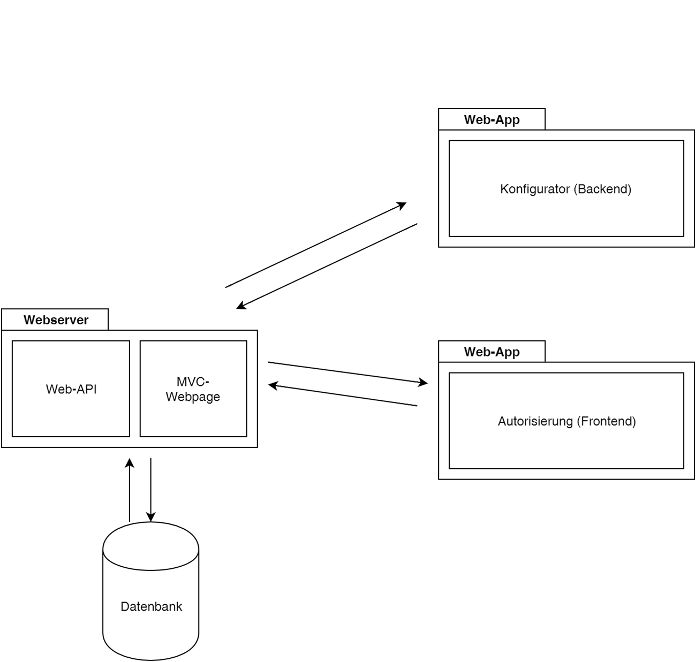

#Konzept
In diesem Kapitel soll ein System für den Authentifizierungsservice entworfen werden. Das System soll den Anforderungen, welche im vorherigen Kapitel definiert wurden, entsprechen. 

Um die Komponenten unabhängig voneinander zu entwickeln, wird bei der Entwicklung der Architektur des Authentifizierungsservice darauf geachtet möglichst geringe Kopplung aufzuweisen.


##Systemarchitektur
Gemäss den nichtfunktionalen Anforderungen muss die Serversoftware - unter anderem - folgende Eigenschaften erfüllen:

- Hohe Verfügbarkeit von 99.9%
- Wartbarkeit
- Performance

Die Softwarearchitektur wurde im Hinblick auf diese Anforderungen erstellt.

\newpage

##Architekturübersicht
Der Authentifizierungsservice besteht aus den Hauptkomponenten: Webserver mit Web-API und MVC-Webpages, Konfigurator und Autorisierung. Die folgende Abbildung zeigt die Verbindungen der drei Hauptkomponenten im Systemkontext des Authentifizierungservice auf.




\newpage
##Genereller Ablauf der Authentifizierung
Der User nimmt an einer Interaktivität eines Anbieters teil. Dabei füllt er den Wettbewerb oder die Umfrage aus oder löst die gegebene Aufgabe und sendet einmal oder mehrmals ein Feedback an die Anbieter-Webseite zurück. Nach Abschluss der Interaktivität werden die Daten gespeichert und mit der daraus resultierenden eindeutigen Identität des Feedbacks wird die Authentifizierung gestartet. Das vom Programmierer definierte Authentifizierungsverfahren, bestehend aus ein oder mehreren Sicherheitsstufen, wird durchgeführt, um die Identität im gewünschten Masse sicherzustellen. Der User und das Anbieter-System werden über die erfolgreiche Authentifizierung informiert. Nach Möglichkeit wird auch eine fehlerhafte Authentifizierung mitgeteilt.


##Domänenmodel Differenziert
Ein differenziertes Domänenmodel - auch Domänenmodel Basis Level genannt - erlaubt eine vereinfachte Kommunikation zwischen Kunde/Auftraggeber und Entwicklungsteam/Entwicklungsperson. Die Denkweise im Model erfordert keine Programmierkenntnisse und fördert die strukturierte Wiedergabe von Datengefässen. Beim Domänenmodel werden die Begriffe aus der Domäne des Kunden verwendet und fördern so die Verständlichkeit auf beiden Seiten.


<!--TODO beschreibung des Models-->

\newpage
##Datenbankdesign
In der Systemarchitektur des Authentifizierungservice stehen Objekte nur während der Ausführungszeit zur Verfügung. Um sie zu persitieren, werden sie in einer relationalen Datenbank gespeichert.
Die Paradigmen der objektorientierten Programmiersprache und der relationalen Datenbank sind grundlegend verschieden. 
So kapseln Objekte ihren Zustand und ihr Verhalten hinter einer Schnittstelle und haben eine eindeutige Identität. Relationale Datenbanken basieren dagegen auf dem mathematischen Konzept der relationalen Algebra. Dieser konzeptionelle Widerspruch wurde in den 1990er Jahren als "object-relational impedance mismatch" bekannt.[^vietnamcomputerscience]
Um diesen Widerspruch zu mindern, stellt Microsoft das Entity-Framework zur Verfügung. 

###Entity-Framework
Das Entity-Framework hat verschiedene konzeptionelle Ansätze um möglichst viele Bedürfnisse an den ORM-Mapper zu erfüllen. Es gilt nun den richtigen Ansatz für den Authenifizierungsservice zu wählen.

####Database First
Beim Database First Ansatz wird zuerst die Datenbankdesign  entworfen. Das Entity-Framework bildet aus der Datenbank die POCO-Klassen[^pocoklasse] ab. Sollten Anpassungen getätigt werden, sollen diese zuerst in der Datenbank implementiert werden und daraus werden wiederum neuen POCO-Klassen generiert.

####Code First
Beim Code First Ansatz werden zuerst die POCO-Klassen erstellt. Das Entity-Framework bildet aus den POCO-Klassen die Tabellen in der Datenbank. Alle Anpassungen werden gleich in den POCO-Klassen umgesetzt und durch das Entity-Framework in der Datenbank geändert erstellt.

####Entscheidung

Wenn die POCO-Klassen gleich mehrheitlich für die Schnittstellendefinition als Parameterdefinition verwendet werden könnten, fallen Mehraufwendungen für Umwandlungen im Programmcode weg. Eine Schnittstellendefinition sollte aber nicht willkürlich durch eine Datenbankänderung beeinflusst werden. Der umgekehrte Fall ist aber minder wichtig, da die Datenbank nur von der Schnittstelle verwendet wird. Deshalb wird das Konzept Code First eingesetzt.

[^vietnamcomputerscience]: [@the-vietnam-of-computer-science]
[^pocoklasse]: Eine POCO-Klasse ist ein ganz "einfaches" .NET-Objekt. Damit ist es geeignet schlank Daten zu transportieren. Weitere Informationen im [Glossar]


###ERD
Durch den Codefirst Ansatz werden die Datenbank und alle zugehörigen Tabellen durch das Entity Framework selbständig generiert


\newpage
##Integration der Schnittstelle
Wie in der Anforderungsanalyse <!--TODO Punkt beschreiben --> und Aufgabenstellung  <!--TODO Punkt beschreiben -->geschrieben, soll die Schnittstelle möglichst einfach in bestehende Systeme integriert werden können. Bevor wir untersuchen, wie wir die Integration umsetzen können, bedarf es die wichtigsten bestehenden Systeme zu kennen um eventuell für diese Systeme eine spezifisch einfache Integration zu entwickeln.

###Bestehende Systeme für Votings, Wettbewerbe und Quizes
Das bestehende Interaktivitäts-Modul wird als Teil einer Webseite in einer Webapplikation geführt. Webapplikation, welche Inhalte verwalten, werden sinngemäss Content-Management-Systeme genannt. Die Abkürzung CMS hat sich im IT-Fachjargon etabliert. Statista.com  wertet mehrmals im Jahr die Verbreitung der verschiedenen CMS aus [^statisticinfostatista]. Folgend ist die Erhebung aus dem November 2015 abgebildet:


Die von statista.com veröffentlichten Zahlen wurden mit Werten von W3techs.com verglichen[^statisticinfow3techs]. Die Unterschiede sind für unsere Verwendung minimal und liegen im Zehntelprozentbereich. Da beide bekannten Statistik unternehmen auf die selben Werte gekommen sind, kann von einem hohen Wahrheitsgrad ausgegangen werden.
Beim Betrachten der Statistik fällt auf, dass Wordpress mit 25,2% mit Abstand am meisten genutzt wird. Alle dynamischen Webseiten unter den Top 10 basieren auf Systemen in PHP[^phpinfotag]. Adobe Dreamviewer und FrontPage sind keine Systeme, welche auf dem Server betrieben werden. Sie sind Editoren, welche auf dem jeweiligen Computer ausgeführt werden und danach mehrheitlich HTML-, CSS- und Javascript-Code an den Server ausliefern. Funktionalitäten werden mit den beiden Editoren manuell geschrieben. 

Basierend auf diesen statistischen Erkenntnissen lohnt es sich die Wordpress Welt kennen zu lernen und recherchieren wie dort eine Authentifizierungsschnittstelle eingebunden werden könnte.

### Wordpress-Plugin Hook
Erweiterungen im Wordpress nennen sich Plugins. Die Plugins können direkt über das CMS-Backend eingespielt werden. Alternativ können sie auch manuell installiert werden. Zum Beispiel, indem man ein Plugin selber programmiert oder beim Hersteller bzw. über das Plugin-Verzeichnis von Wordpress[^Plugin-verzeichnis2] herunterlädt. Wordpress sammelt zugleich die aktiven Installationen der Plugins (sofern man als Entwickler den Informationsaustausch nicht unterbindet). Die Gesamtzahl wird im CMS-Backend Wordpress und auf Ihrer Plugin-Verzeichnis Webseite[^Plugin-verzeichnis2] veröffentlicht. Dank dieser Kennzahl können nun die meistverbreiteten Plugins herausgefunden werden. 

<!--TODO Auflistung von bekannten Plugins -->

Wordpress basiert auf einem sogennanten Hook-System. "Hook" bedeutet "Haken", "Aufhänger" oder "Greifer". Ein Hook ist im Wordpress eine definierte Codestelle, bei der man seinen eigenen Code  einhaken kann. Der Plugin-Entwickler definiert diese Hooks, um anderen Plugins oder Funktionalitäten zu erlauben sein Plugin zu erweitern. Auch der Core von Wordpress enthält solche Hooks. Dadurch soll verhindert werden, dass Plugins oder der Core von Wordpress direkt umgeschrieben werden muss und dann nicht mehr einfach so unabhängig upgedatet werden kann. Um unsere Schnittstelle einzubinden, könnten wir also solche Hooks verwenden. Dieser "Hook"/Haken hat lustigerweise auch einen Haken: Der Plugin-Entwickler kann selbständig bestimmen, ob und wo er solche Hooks einsetzen will und welche Möglichkeiten dann zur Verfügung stehen. Kommerzielle Plugins verfolgen vielfach den Weg möglichst verschlossen zu agieren, um mögliche Erweiterungen monetär umzusetzen und so eine Abhängigkeit zu erzeugen. Diese These gilt es nun zu untersuchen. Dafür wurden verschiedene Interaktivitäten-Plugins ausgewählt. Aus den Top 1000 der installierten Wordpress Plugins, welche von der Art Social-Media Modul sind werden Stichproben von kommerziellen Plugins und Stichproben aus in Beiträgen empfohlenen Plugins zur Untersuchung verwendet: [^Plugin-verzeichnis2], [^Plugin-market2]

------------------------------------------------------------------------------------------
__Plugin__				__Kosten__  __Installation__ 	__Info zu Hooks__		
-----------------------	-----------	-------------------	----------------------------------
__WP-Polls__        	kostenlos	100000+			 	Über "wp_polls_add_poll" könnte man den erstellten Poll authentifizieren  und bei fehlerhafter Authentifizierung löschen

__Polldaddy Polls  		Freemium 	20000+			 	-
& Ratings__

__Wp-Pro-Quiz__			kostenlos	20000+			 	Hooks vorhanden. Nicht für eine Authentifizierungsschnittstelle zu gebrauchen.
	
__Responsive Poll__		15$			-				 	Keine Hooks. Laut Hersteller sind welche geplant (Zeitpunkt ungewiss)

__TotalPoll Pro__		18$			-				 	Hooks vorhanden. Ähnlich wie bei WP-Polls könnte man evtl. den erstellten Datensatz löschen. Jedoch ist dies ohne Kauf nicht ersichtlich.

__Easy Polling__		15$			-				 	-

__Opinion Stage__		kostenlos	10000+			 	-

__Wedgies__      		Freemium	800+			 	- 

------------------------------------------------------------------------------------------
Table: Recherche Plugins  


Wir haben nun verschiedene Wordpress-Plugins für Interaktivitäten auf Hooks untersucht. Alle Plugins bieten gar keinen Hook an oder keinen Hook, welcher unseren Anforderungen einer einfachen Integration genügt. Die aufgelisteten Plugins bilden eine wesentliche Verbreitung ab. Selbst wenn wider Erwarten alle nicht untersuchten Plugins eine perfekte Hookanbindung liefern würden, hätten wir, mit den nicht untersuchten Plugins eine zu geringe Verbreitung. Der Ansatz, die Integration per Hooks zu machen, muss also fallen gelassen werden.

[^statisticinfostatista]: CMS-Nutzungsstatistik von statista.com [@statisticinfostatista]
[^statisticinfow3techs]: CMS-Nutzungsstatistik von w3techs.com [@statisticinfow3techs]
[^phpinfotag]: Die Information wurde von den jeweiligen Hersteller- bzw. Communitywebseiten bezogen.
[^Plugin-verzeichnis2]: Das Pluginverzeichnis befindet sich unter http://de.wordpress.org/Plugins
[^Plugin-market2]: Envato bietet eine Plattform für den Verkauf von Wordpress-Plugins an http://market.envato.com


\newpage

### Parallelen im ähnliches Anwendungsfeld 
Die vertiefte Untersuchung der letzten Kapitel wird beendet und es wird probiert eine andere Herangehensweise zur Lösungsfindung zu suchen: Forscher adaptieren immer wieder er- folgreiche Modelle aus anderen Bereichen in ihr Gebiet. Vielfach wird die Natur als erfolgreiches Vorlagemodell genommen. Ganz soweit wird hier nicht gegangen. Payment-Gateways, wie der Schweizer Anbieter Datatrans, müssen Webshop-Entwicklern auch eine Möglichkeit bieten das Gateway einfach in Ihren Webshop einbinden zu können. Auch bei ihnen steht die Sicherheit an der ersten Stelle und eine einfache Integration ist für den Erfolg - trotz internationalem Druck - notwendig. 
Dabei fährt Datatrans eine Zweiwegstrategie. Einerseits stellen sie stellen für bekannte Shopsysteme gleich ganze Plugins zur Verfügung[^dt-Plugin]. Auf der anderen Seite bieten sie ausführlich beschriebene und einfache Schnittstellen an.

#### Datatrans Zahlungsablauf
Um die Gateway-Implementation der Datatrans als Ganzes zu verstehen, führen wir uns den generellen Ablauf eines Payment-Gateways eines Webshopeinkaufs bei Datatrans vor Augen. Der Ablauf:

<!---->

1.	Der Endkunde wählt ein oder mehrere Produkte aus und schliesst die Bestellung ab
2. 	Der Merchant(Webshop) zeigt Zahlungsseite von Datatrans, Karteninhaber gibt seine Kartendaten ein.
3. 	Datatrans autorisiert und verarbeitet - wenn möglich - die Transaktion zum Acquirer(akquirierende Bank).
4. 	Datatrans zeigt den Status dem Kunden an und sendet Status dem Merchant(Webshop) zurück.
5. 	Merchant(Webshop) zeigt dem Karteninhaber die Antwortseite (erfolgreich oder abgelehnt)
[^dt-api]

[^dt-Plugin]: Übersicht der Web-Shop Plugins [@datatrans-Plugin]

\newpage

#### Datatrans XML/SOAP API Lightbox Mode
Bei Schritt 2 des Zahlungsablaufs ruft der Webshop das Datatransgateway auf. Beim "Lightbox Mode" wird dabei ein iframe in einem Overlay über die Webseite gelegt und der Webshop selbst wird verdunkelt dargestellt.


Das Gateway muss ein Minimum an Informationen erhalten, um den Zahlungsvorgang überhaupt starten zu können. So muss es wissen, wer der Verkäufer ist. Datatrans regelt dies über eine Merchant-ID. Wieviel Geld in welcher Währung verkauft werden sollte, muss Datatrans über amount und currency mitgeteilt werden. Um dem Shop später mitteilen zu können, welche Bestellung erfolgreich verarbeitet wurde, braucht es eine Referenznummer. Die Referenznummer nennt Datatrans singemäss refno. Die ganzen Parameter werden optional mit einem sign-Parameter gesichert und mittels Html-Form dem Javascript übergeben:[^dt-api]

\newpage

Implementierungscode der Datatrans:


\begin{lstlisting}[language=html] 
<script src="https://code.jquery.com/jquery-1.11.2.min.js"></script>
<script src="https://pilot.datatrans.biz/upp/payment/js/datatrans-1.0.2.js"></script>

	<form id="paymentForm"
		 data-merchant-id="1100004624"
		 data-amount="1000"
		 data-currency="CHF"
		 data-refno="123456789"
		 data-sign="30916165706580013">
		 <button id="paymentButton">Pay</button>
	</form>
	
<script type="text/javascript">
	 $("#paymentButton").click(function () {
		Datatrans.startPayment({'form': '#paymentForm'});
	 });
</script>
\end{lstlisting}


### Integrationsentscheid

Die Stragtegie der Paymentintegration von Datatrans soll für den Authentifizierungservice genutzt werden. 

Durch automatisches Öffnen der Lightbox erreicht der Endbenutzer mühelos den Schritt der Authentifizierung. Die Authentifizierung springt ihm nahe zu entgegen. Dadurch ist eine hohe Effektivität gegeben. Der User bleibt auf derselben Seite und wird dadurch nicht aus dem Fluss der Abarbeitung der Interaktivität geworfen. Das Verfahren ist sehr effizient. Die Javascript- und CSS-Daten werden beim Laden der Interaktivität bereits mitgeladen. So entsteht eine minimale Wartezeit beim Einblenden der Lightbox. Dies ist für den User nicht spürbar oder störend. 

Bei der Darstellung der Authentifizierung auf einer einzelnen Seite müsste das Web-Design des Interaktivitäts-Anbieter adaptiert werden können. Da die Authentifizierungs-Lightbox auf seiner Seite dargestellt wird, braucht der Interaktivitäts-Anbieter nicht sein Design mühsam für eine Authentifizierungsseite zu konfigurieren. 

Die Lightbox des Authentifizierungsservice wird mit einer grösseren Verbreitung einen gewissen Wiedererkennungswert erhalten. So wird die Lösung als professionelles Produkt wahrgenommen werden. Das Ziel, dass Benutzer und Entwickler den Authentifizierungsservice als ein sicheres und glaubwürdiges Produkt für Interaktivitäten wahrnehmen, wird so versteckt werden.

\newpage
### Integrationskonzept

Der eingeschlagene Weg für die Integration wird nun konkret festgehalten. Die Parameter für die Schnittstelle zwischen Anbieter und Authentifizierungs-Lightbox sind eindeutig spezifiziert:

------------------------------------------------------------------------------------
__Feldname__				__Wert__		__Beschreibung__												
--------------------------- ---------------	----------------------------------------
__projectId__            	Integer			Project ID			

__providerId__ 				String			Die ID um die Interaktivität seitens Interaktionsanbieter eindeutig zu erkennen
	
__sign__					String			Signatur, welche die Eingaben überprüft.

-----------------------------------------------------------------------------------
Table: Parameter Authentifizierungsservice Lightbox


#### Einfache Signatur

Die Verwendung einer einfachen Signatur beugt Eingabefehler vor. Die Signatur, ist eine weitere Hürde den Missbrauch der Schnittstelle zu verhindern. Um eine korrekte Signatur zu erstellen werden folgende Parameter konkateniert und mit einem Plus(+) separiert.

- projectId: Parameterfeld
- providerId: Parameterfeld
- validationCode: Beim Anlegen eines Projektes im Konfigurator des Authenifizierungsservice soll ein ValidationCode vom Authenifizierungsservice generiert werden und dem Programmierer zur Verfügung gestellt werden.


Beispiel:
```30045+12+BUQHFMNZ4P3T8XNVN0LK```

Der daraus resultierende String wird mit MD5 verschlüsselt.

Beim Beispiel gäbe es die Signatur ```b37b3d4cd7cd8cba3f409f07d6f6d9bd```

###Schlussspeicherung
Nach Abschluss der Authentifizierung erhält der User visualisiert ein Feedback. Sofern die Authentifizierung erfolgreich war, wird im Hintergrund die im Konfigurator angegebene URL des Anbieters aufgerufen. Über die Post-Parameter ProjectId und ProviderID erfährt die Serverapplikation um welchen Datensatz es sich handelt. Wiederum wird der sign-Parameter zum Absichern mitgegeben. Die Gefahr besteht trotzdem, dass diese Redirect-URL auch von einem anderen Programm aufgerufen werden könnte. Deshalb kann als zweite Absicherung die Serverapplikation des Anbieters die Validate WebAPI des Authenifizierungsservice aufrufen und die erhaltenen Daten gegenprüfen. Bei erfolgreicher Gegenprüfung gilt der Datensatz seitens Anbieter auch als valide und kann dann persistiert werden.

\newpage

##Sicherheitstufen integrieren

Im Kapitel [Recherche] wurden einige Sicherheitskomponenten recherchiert und illustriert. Es gilt nun ein Setting an Komponenten zu finden, welche dem Programmierer eine Breite Auswahlmöglichkeit (NFREQ-210) bietet  und eine genügende Verbreitung in der Schweiz hat (NFREQ-212), ihn aber nicht durch komplexes Auswählen der Sicherheitsstufen aufhält (NFREQ-222).


####Cookie
Durch Speicherung des Cookies soll ein Benutzer der bereits an einer Interaktivität teilgenommen hat, identifiziert werden. Da die Cookies clientseitig verwaltet werden, können diese auch vom Anwender manipuliert werden. Mit Browser-Makro-Tools wie iMacro kann ganz einfach ein Cookie gelöscht werden. Dadurch ist sowohl das Verhindern mehrfacher Teilnahmen, wie auch das Verhindern einer automatisierten Teilnahme an einer Interaktivität ungenügend geschützt. Vorteilhaft für die Cookiemethode ist, dass der Benutzer keinen Aufwand betreiben muss und es keine Kosten verursacht.


####IP-Adresse
Durch Speicherung der IP-Adresse soll ein Benutzer der bereits an einer Interaktivität teilgenommen hat, identifiziert werden. Eine IP-Adresse vertritt gegen Aussen alle Benutzer mit dem selben "Internetanschluss". Dadurch könnte nur einmal pro Internetanschluss an einer Interaktivität teilgenommen werden. Dass durch Wechseln des Proxys eine andere IP-Adresse verwendet werden kann und dies auch ohne IT-Know-How durch Tools möglich ist, lässt sowohl Eindeutigkeit und Verhinderung von Automatisierung als ungenügend bewerten. Die Methode kann als kostenlos eingestuft werden und generiert beim Endbenutzer keinen Aufwand

####Browser Fingerprint
Durch Generierung eine Browser Fingerprints (siehe [Recherche]) kann der Browser identifiziert werden. Das Verfahren kann zu 94% einen User wiedererkennen. Das Verwenden mehrerer Browser oder Geräte führt zu verschiedenen Browser Fingerprints. iPhone taugt nicht für disese Methode. Deshalb muss Eindeutigkeit und Verhinderung von Automatisierung als ungenügend bewertet werden. Die Methode kann als kostenlos eingestuft werden und generiert beim Endbenutzer keinen Aufwand.

####SMS Authentifizierung
Der Benutzer gibt seine Mobilenummer ein. Durch Versenden eines Codes wird sichergestellt, dass dem Benutzer die Telefonnummer gehört. In der Schweiz können maximal 5 Mobilenummern bei den Anbietern gekauft werden (Siehe Kapitel [Recherche]). Der Benutzer kann eindeutig anhand der Mobilenummer erkannt werden. Die möglichen Mobilenummern pro User sind beschränkt. Eine Automatisierung ist praktisch unmöglich. Die Kosten pro SMS sind tragbar. Der Benutzer muss bei dieser Methode sein Handy bei sich tragen und den Code übertragen.

####Telefon Authentifizierung
Der Benutzer gibt seine Telefonnummer ein. Der Benutzer wird automatisiert angerufen und die Computerstimme liest ein Code vor, welcher der Benutzer im Rückbestätigungsformular einträgt. Dadurch wird sichergestellt, dass die Telefonnummer dem Benutzer gehört. Mobilenummern sind wie vorhin erwähnt eingeschränkt. Festnetzanschlüsse unterliegen einer finanziellen Hürde. 

####Postversand Authentifizierung
Der Benutzer gibt seine Adresse ein. Um sicherzustellen, dass die Adresse dem User gehört wird automatisiert ein Brief an die Adresse gesendet. Da die Gefahr besteht dass falsch adressierte Briefe den Empfänger trotzdem erreichen, deshalb wird Unique mit gut und nicht sehr gut bewertet. Eine Automatisierung ist praktisch unmöglich. Die Kosten pro Brief sind von allen aufgelisteten Methoden am höchsten. Der Benutzer muss bei dieser Methode den Brief nach Erhalt auf einer Webseite quittieren.


###Sicherheitstufen bewerten
Die Recherche der verschiedenen Sicherheitsstufen wurden dem Auftraggeber vorgelegt. Beim Auftraggeber wurden die verschiedenen Sicherheitsstufen intern besprochen und bewertet. Pro Sicherheitsstufen wurde den vier definierten Aspekten und dem Musskriterium Verbreitung eine Bewertung in Form einer Schweizer Schulnote vergeben.

------------------------------------------------------------------------- -------------------------------------------------
__Sicherheitsstufen__		__Verhinderung		 __Automat-			__Kosten__	   	__Aufwand	  	     __Verbreitung	
							Mehrfachteilnahme__	sierung__							Benutzer__			 in der Schweiz__				
--------------------------  ------------------- ------------------- --------------- ------------------- -------------------
__Cookie__				  	2.5 		     	2.5 				6				6                	6
 
__Flash-Cookie__		  	2.5 		     	3					6				6                	6 
                                                                          
__IP__				      	3					3 					6				6             		6
                                                                          
                                                                          
__Browser 					3.5					3.5	 				6				6             		6
Fingerprint__			                                                      
                
__E-Mail__					4					4.5					6				4.5           		6
                                                                              
                                                                              
__SMS__						5.5					5.75				5				4.5           		5.5
						                                                      
                                                                              
						                                                      
__Telefon__					5.25				5.75				5				4.5           		5.75
						                                                      
                                                                              
						                                                      
__Ausweis-					3.5					3.5					6				5          	  		6
nummer__        
                
                
__SuisseID__				5.5					5.75				5				5			  		3
																		      		
------------------------------------------------------------------------- -------------------------------------------------
Table: Übersicht der Authentifizierungs Methoden


###Auswahl der zu integrierenden Sicherheitsstufen
SuisseID und Flash-Cookies erreichen beim Musskriterium Verbreitung in der Schweiz ([NFREQ-212](FREQ-212)) keine genügende Note und werden daher ausgeschlossen. Um die geforderte Breite an Sicherheitsmethoden zu erlangen wurden die folgenden Methoden mit verschiedenen Stärken in Aspekten durch den Auftraggeber ausgewählt:

- IP-Adresse
- E-Mail
- SMS
- Telefon
- Ausweisnummer
 

\newpage
##Modularität und Erweiterbarkeit
Wie in der Einführung zur [Architektur] erwähnt, sollte eine Architektur so konstruiert werden dass Sie möglichst Modular aufgebaut ist. Auch wenn wir die zu verwendenden Authentifizierungsmethoden im vorherigen Kapitel definiert haben, werden sich diese in Zukunft ändern. Anderseits können sich auch die Authentifizierungsmethoden selbstkomplett verändern. Sehr realistisch ist, dass für einen Browser-Fingerprint neue Berechnungsmethodiken bekannt werden. Der Anbieter, der hinter eine Authentifizierungsmethode steht, kann sich verändern oder dessen Anbindung anpassen. Kurz gesagt, die Modularität der Authentifizierungsmethoden muss unbedingt gewährleistet sein. Eine Implementation der Sicherheitsstufe SMS wie im folgenden einfachen Beispiel sollte nicht verwendet werden.

\begin{lstlisting}[language={[Sharp]C}]
SMSSecurityStep inst = new SMSSecurityStep();
\end{lstlisting}

###Design by Contract
Das Design Pattern "Design by Contract" soll das Zusammenspiel von Modulen durch eine Definition/Vertrag regeln. Herr Bertrand Meyer führte das Pattern bei der Entwicklung der Programmiersprache Eiffel ein.[^design-By-Contract] Die Vertragsdefinition besteht aus

- precondition: "Die Zusicherung, die der Aufrufer einzuhalten hat"
- postcondition: "Die Zusicherung, die der Aufgerufene einhalten wird"
- Invariants:	"Invariants sorgen dafür, dass bei Eintritts- und Austrittspunkten des Server Codes gewisse Bedienungen erfüllt bzw. Zustände gewahrt sind. Invariants sind in gewisser Weise also Pre- und Postconditions."

Im Grunde geht es darum, den Operator new zu eliminieren.

Der Beispielcode als Design by Contract Pattern:

\begin{lstlisting}[language={[Sharp]C}]
ISecurityStep proxy = new SomeFactory.GetSecurityStep(...);
\end{lstlisting}

ISecurityStep-Vertrag ist im Beispielcode der Vertrag. Die Instanz "proxy" liefert ein Objekt zurück, welches nach ISecurityStep-Vertrag definiert ist. Welches Objekt (Implementierung) sich dahinter verbirgt, ist uninteressant da diese Komponente gegen eine andere Implementierung ausgetauscht werden kann. In diesem konkreten Fall, könnten beispielsweise die Komponenten SMSSecurityStep und CookieSecurityStep die Schnittstelle ISecurityStep implementieren.

SomeFactory muss für die Umsetzung  jedoch implementiert werden. Dafür gibt es in der .NET-Welt einiges an Beispiel-Code und Frameworks zu finden. Ein beliebtes Framework ist die Windows Communication Foundation.[^design-By-Contract]


###MEF - Managed Extensibility Framework
MEF, das Managed Extensibility Framework, ist seit der Version 4.0 Bestandteil des .NET Frameworks. MEF ist eine Bibliothek und implementiert das Problem der Erweiterbarkeit sogar zur Laufzeit. Es vereinfacht die Implementierung von erweiterbaren Anwendungen und bietet Ermittlung von Typen, Erzeugung von Instanzen und Composition Fähigkeiten an.


Die Abbildung zeigt eine stark vereinfachte Architektur von MEF auf. Die Hauptmodule vom MEF-Core sind Catalog und CompositionContainer.
Der Catalog kontrolliert und stellt das Laden der Komponenten sicher. Der CompositionContainer erzeugt aus den Komponenten Instanzen und bindet diese an die entsprechenden Variablen.
Parts sind die Objekte die vom Type Export oder Import sein können. Die Komponenten die geladen und instanziert sind nennen sich Exports. Imports sind die Variablen, an den Exports gebunden werden sollen. 

Um das Konzept besser zu verstehen, soll der Beispielcode von [Design by Contract] herangezogen werden: In einer MEF-Anwendung wäre die Variable proxy vom Type ISecurityStep und die Instanz dieser Komponente wäre ein „Import“. Die Objekte der SMSSecurityStep oder CookieSecurityStep wären in einer MEF-Anwendung ein Export.

MEF automatisiert die Instanzierung mit Hilfe von Catalog und Container.

###Entscheidung
Der Ansatz der Umsetzung des Design by Contract bräuchte eine geeignete Integration für die Factory um die Modularität für [NFREQ-115] sicherzustellen. MEF stellt den vollen Umfang an Funktionalität, zur Lösung der Problematik, zur Verfügung.  MEF bietet des Weiteren die Möglichkeit die DLL-Datein zur Laufzeit auszutauschen und eine automatisierte Instanzierung. Deshalb sind die Sicherheitsstufen des Authentifizierungsservice basierend auf MEF zu integrieren.

\newpage
### Sicherheitsstufen Library-Übersicht anhand MEF
Basierend auf dem Managed Extensibility Framework wird der Aufbau umstrukturiert. Neu wird nicht alles in einer Library im Webservice gespeichert sondern mehrere Libraries  erstellt. Die Library SecurityStepContracts beinhaltet den Contract/Vertrag der Sicherheitsstufen ISecurityStep. Es besteht keine Abhängigkeit zwischen dem Authentifizierungsservice und den Sicherheitsstufen. 


[^design-By-Contract]: [@design-By-Contract]


### Definition der Sicherheitsufenverträge

####Verträge für das Backend
Pro Projekt des Anbieters und muss der Programmierer für jede Sicherheitsstufe verschiedene Konfigurationen tätigen können. Die Konfigurationen können da variieren. So kann bei der Sicherheitsstufe E-Mail der Absendername und Antwort-E-Mail-Adresse definiert werden, bei der Telefonvalidierung ein Grusswort. Es soll eine Abfrage der Konfigurationsparameter pro Plugin vorhanden sein. Diese soll mit allfällig bereits erfassten Werten übermittelt werden. Um die Werte zu speichern muss eine Speicherfunktionion pro Plugin aufrufbar sein. Weiter sollen statische Vergleichsparameter pro Plugin übergeben werden können. Die Vergleichsparameter entsprechen generell den Angaben aus Kapitel [Sicherheitstufen bewerten]. Für neuere Plugins werden diese Bewertungen vom Auftraggeberteam neu definiert. Anzumerken ist hier, dass die Studienergebnisse zentral verwaltet werden und dynamisch sofern  das Plugin in der Studie bewertet wurde, ausgelesen werden.

####Verträge Frontend
Der Authentifizierungsservice soll von jedem Sicherheitstufen-Plugin den Status über die Validierung erfragen können. Um die Validierung der einzelnen Stufe (noch einmal) zu beginnen oder als valide zu bezeichnen.
Das Microsoft MVC-Framework braucht, falls nicht anders definiert, eine Index-Seite pro Controller. Diese Vorbedingung wird als Einstiegspunkt für die Validierung einer Sicherheitsstufe verwendet.

Aus den gegeben Ansprüchen wird folgendes Interface konzeptioniert:


\newpage
##Mockup
Ein Mockup ist eine grobe Vorlage für die Design-Umsetzung. Es ist eine ideale Möglichkeit das visuelle Konzept abzubilden und mit dem Auftraggeber vorgängig anzuschauen. Die folgenden Unterkapitel bilden die Mockups der App ab.

###Konfigurator Template
Der Konfigurator soll den Programmierer visuell beim Konfigurieren und Verwalten seiner Authentifizierungssoftware unterstützen. Bei der Zielgruppe handelt es sich um Programmierer. Es kann deshalb von einem hohen Know-How ausgegangen werden. Die Oberfläche soll möglichst effizient gestaltet sein. Die Designelemente sollen deshalb klar und einheitlich gestaltet werden. Generell ist davon auszugehen, dass der Programmierer beim Einrichten seines Projektes am Desktop-Computer arbeitet. Für Auswertungen und Präsentationen kann der Programmierer durchaus auch mobile Endgeräte verwenden. Deshalb soll die Umsetzung responsive gestaltet werden.


\newpage


####Seitenaufbau
Im Header wird der Programmierer anhand des Seitentitels gleich über seinen aktuellen Standort orientert. 

####Navigation
Im Designkonzept ist von einer Klappmenü oder Topnavigation abgesehen. Die Wichtigkeit, durch einen Klick alle Navigationspunkte zu erreichen, überwiegt den Platzersparnissen in der Breite. Die wenigen Navigationspunkte erlauben eine flache Navigationsstruktur. Dadurch können in der Desktopansicht links immer alle Navigationspunkte angezeigt werden. Der Programmierer kann rasch auf die gewünschte Seite wechseln. In der Mobileansicht kann durch einen einzigen Klick auf die "Burger-Navigation" das gesamte Menü eingefahren werden. Der Entscheid, für eine statische linke Navigationsstruktur in der Desktopansicht, wurde ausserdem bekräftigt durch den Wunsch des Auftraggebers den Konfigurator gestalterisch mit Farben und Bildbereich aufzuwerten. Dies ist über die linke Spalte einheitlich und einfach umsetzbar.

\newpage
####Inhaltaufbau
Trotz unterschiedlichstem Inhalt (Text, Tabellen, Diagramme, Bilder und Formulare) und Grösse soll eine einheitliche Struktur geschaffen werden. Die Struktur soll es erlauben, einerseits Übersichte,n wie Dashboards mit verschiedenen Inhalten, auf einer Seite abzubilden. Andererseits soll die selbe Struktur aber  auch für Seiten mit nur einem Inhaltselement, wie Registration oder Login-Seite verwendet werden können. Verschiedene Designe lösen diese Problematik mit einem Karten-Konzept (Card Based Design). Dabei wird jedes Inhaltselement als "Card" dargestellt. Die "Card" hat einen klar abgegrenzten Darstellungsbereich. Die Card ist in Header und Content unterteilt. Im Header wird mittels Titel dem Anwender kommuniziert, was für ein Inhalt im Bereich Content der "Card" zu erwarten ist. [^card-based-design]


\newpage
###Authentifizierungs-Lightbox Template
Die Authentifizierungs-Lightbox wird vom Endbenutzer verwendet. Der Endbenutzer kann ein geringes technisches Know-How aufweisen. Deshalb muss das Design einen Bereich verfügbar machen, in welchem die zu tätigenden Schritte erklärt werden können. Die Möglichkeiten und Anzahl der Schritte sollen auf ein Minimum gehalten werden. Im besten Fall kann der User eine Eingabe machen und dies mit einem Button bestätigen. Damit der Endbenutzer fokussiert bleibt, soll, wie bei einer Lightbox üblich, der Rest der Seite abgedunkelt werden. 


###Hinweis zur Zusammenarbeit mit dem Auftraggeber
Die hier abgebildeten Mockups und weitere Ansichten sind das Ergebnis aus den Absprachen mit dem Auftraggeber. Sie sind vom Auftraggeber abgenommen und zur Implementation freigegeben.

[^card-based-design]: Weitere Informationen und Beispiele auf webdesigner.com [@card-based-design]

\newpage

## "Du" oder "Sie" – Ansprache
Die Definition, ob der Benutzer im Userinterface mit Du oder Sie angesprochen werden soll, muss laut Jutta Beyer, vorgängig klar geregelt sein.[^dusieansprache] Eine einheitliche Kommunikation auf der Plattform ist unabdingbar.

###Bestehende Vorurteile

-------------------------------------------------------------------------------------
__Art__   	__Positiv__                     	__Negativ__           
----------- ----------------------------------- -------------------------------------
__Du__		Du steht für \						Du steht aber auch für \
			- Vertrautheit \					- weniger Respekt \
			- Verbundenheit \					- weniger Kompetenz \
			- Modern \							- "Stammtischniveau"  \

__Sie__		Sie steht für \						Sie steht aber auch für \
			- Respekt \							- Distanz \
			- Kompetenz	 \						- Altmodische Einstellungen \
			- Seriösität \						- Emotionslos     \
-------------------------------------------------------------------------------------
Table: Auflistung von Vorurteilen


Diese Wahrnehmungen sind nicht stichhaltig noch weniger können die Rückschlüsse stimmen. Dennoch müssen diese Ansichten, zum Teil entstanden aus Kultur und Tradition, ernstgenommen werden, da sie in unseren Köpfen tief verankert sind. Kindern wird beigebracht, dass man Fremde mit "Sie" anspricht.  In der Familie, die Geborgenheit und Vertrautheit ausstrahlt, ist das "Du" normal. Gegenüber Lehrern und anderen Autoritätspersonen sollte das Kind aber "Sie" sagen. Also spricht das Kind auch im fortgeschrittenen Alter Erwachsene, vor denen es zugleich Respekt haben sollte, mit "Sie" an.[^dusieansprache]

Eine generelle Aussage  zur Verwendung Du oder Sie auf Webseiten kann also nicht gemacht werden. Im Jahre 2011 wurden von statista Personen in Deutschland gefragt, "Wie möchten Sie in Social Media von Unternehmen angesprochen werden?". Dabei möchten 44% der befragten per Sie angesprochen. Einem grossen Teil (43%) ist die Ansprache egal und 13% würden eine Du-Ansprache bevorzugen.[^statistadusie]

\newpage
####Entscheidung
Die Authentifizierung, welche vom Endbenutzer durchgeführt wird, darf ruhig sprachlich distanziert und emotionslos wirken. Vielmehr sind Respekt, Kompetenz und Seriosität wichtige Eckpunkte dieses Produkts. Deshalb wird in der Authentifizierung der Endbenutzer, falls nötig, mit Sie angesprochen.
Der Konfigurator wird durch den Programmierer administriert. Hier gilt es zu vermitteln, dass der Programmierer sich angenommen und unterstützt in seinem Problemen / Herausforderungen fühlt. Das Produkt soll zeitgemäss und trendig sein. Deshalb wird die Kommunikation über Du geführt. Diese Entscheidung wird durch die Annahme unterstützt, dass unter Programmierern auch in der Wirtschaft mehrheitlich geduzt wird.


[^dusieansprache]: [@dusieansprache]
[^statistadusie]:[@statistadusie]

\newpage

##Wahl des Applikation Hosters
###Asp.net Shared Hosting
Ein ASP.NET Shared Hosting ist durchaus für komplexere Webapplikationen wie der Authentifizierungservice ausgerichtet. Die Kosten sind jährlich fix und nicht abhängig von der eigentlichen Nutzung. Überschreitet die Applikation den Speicherbedarf, Zugriffszahlen oder Traffic kann auf ein grösseres Paket gewechselt werden. Ein Wechsel zu einem kleineren Paket ist meist nur jährlich möglich. Die Skalierbarkeit ist stark eingeschränkt. Die Daten können innerhalb der Schweiz gespeichert werden. Der zuständige Systemtechniker ist meist direkt oder indirekt kontaktierbar. Spezielle Konfigurationen am Hosting sind nicht möglich. Die Datencenter sind meist nicht redundant geführt. Fällt das Datencenter aus ist, die Applikation nicht verfügbar.

###Cloud Hosting
Die Serverkosten sind direkt von der eigentlichen Nutzung abhängig. Das Hosting ist skalierbar und kann sich automatisiert an die aktuellen Nutzungsbedürfnissen anpassen. Die realen Kosten sind im vornherein schwerer zu definieren. Die Daten sind in der Cloud redundant gehalten. Fällt ein Datencenter aus, kann ein anderes dessen Aufgabe übernehmen. Ein schweizer Anbieter der direkt ASP.NET Webservice als Cloud-Hostingservice anbietet wurde nicht gefunden.[^cloudservicech] Indirekt z.b. über ein Docker Image könnte auch ein Schweizer Anbieter berücksichtigt werden. Die genutzten Serverdienste können komplett an seine eigenen Bedürfnissen angepasst werden.
Beim Cloud Service von Micorosoft kann direkt im VisualStudio administriert werden. Alle nötigen Resourcen können in der Entwicklungsumgebung konfiguriert werden. Ausserdem ist das einfache publishen der Webanwendung praktisch über einen Knopfdruck aus Visual Studio möglich. 

###Entscheidung
Die in [NFREQ-132] geforderte Skalierbarkeit, nutzungsabhängige Kosten und die Freiheit in der Serverdienst-Konfiguration überwiegen der Speicherung der Daten in der Schweiz. Das einfache publishen (veröffentlichen) und konfigurieren einer Web-Applikation aus Visual Studio wird bei Microsoft Azure angeboten, was den Development Workflow erheblich unterstützt. Deshalb ist der Authentifizierungsservice im Cloud Hosting zu betreiben. 


[^cloudservicech]: Stand 18. Dezember 2015

##Validierung von Benutzereingaben
[NFREQ-126] und die Sicherheit des Authentifizierungsservice verlangen eine geeignete Validierung der Benutzereingaben. Um Fehlspeicherungen oder Fehloperationen vorzubeugen, werden alle Daten vorgängig validiert. Die Fehlermeldungen sollen - falls möglich - klar und spezifisch formuliert werden. 
Bei den Daten-/POCO-Klassen werden die gültigen Wertebereiche mittels Annotationen festgelegt. Microsoft MVC und Microsoft Web-API stellen eine "Modelstate.Valid()"-Methode zur Verfügung, welche das angelieferte Datenobjekt automatisch gegen die Annotationen prüft. Bei MVC-Implementierungen werden mittels Microsoft jQuery Validate Standard Annotationen bereits in der Benutzereingabemaske überprüft. So muss der User bei Falscheingabe nicht zuerst einen manuellen Request auf den Server setzten, sondern wird gleich über die Fehleingabe aufmerksam gemacht.
Im Konfigurator, eine AngularJS-App, ist die benutzerseitige Validierung mittels HTML5 Form Validation umgesetzt worden.


##Testing
Die gewählte Architektur und Dependency Injection vereinfachen das Testing.

###Wie kann getestet werden?
Der Authentifizierungsservice und die Sicherheitsstufen können wie normale Web-Applikationen in MVC oder Web-API getestet werden. Jedes Sichrheitsstufen-Plugin sollunabhängig gekapselt getestet werden. Um in Unit-Test keine Datenbank zu nutzen soll das Repository Pattern eingesetzt werden.

###Was soll getestet werden?
Grundsätzlich sollte die Logik, welche im Controller ist, getestet werden. Wird eine spezielle Logik ausserhalb der Controller verwendet, so soll auch diese getestet werden. 


###Repository Pattern
Wie im Kapitel [Testing] beschrieben, sollte eine Möglichkeit geschafft werden, Datenbanken losgelöst zu testen. Dafür wir das Repository-Pattern eingesetzt. Das Repository-Pattern sieht vor, dass jedes POCO-Objekt genau eine Schnittstelle hat, an denen es die CRUD-Operationen ausführen kann. Im Prinzip eine Schnittstelle, die auf alle Anfragen an die Datenbank eine passende Reaktion hat. Diese Schnittstelle oder der Punkt, an welchem Anliegen bearbeitet werden, ist das Repository. Für beinahe jedes Objekt, was persistiert wird.

Definition des Repository-Patterns von Edward Hieatt and Rob Mee:
"Vermittler für den Zugriff auf Domänenobjekte zwischen den Domänen- und Daten-Mapping-Schichten mit Hilfe einer Collection-artigen Schnittstelle"

Die Vorteile des Patterns sind zum einen die vereinfachten Unit-Tests. Man kann jedes Repository einfach testen und so auf seine korrekte Funktionalität überprüfen. Zum anderen bieten Repositories eine zentrale Anlaufstelle für Datenbankoperationen. Eine gemeinsame Schnittstelle gegenüber den Datenhaltungs-Schichten. Zudem bietet es einen idealen Punkt, an dem man Mechanismen, wie beispielsweise Caching, implementieren kann.
[^repository]


[^repository]:[@repository]


[^dt-api]: Für die Bachelorarbeit wurde die V 9.1.13 verwendet [@datatrans-api]


