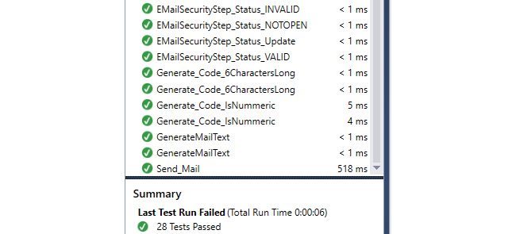

#Proof Of Concept

Das Ziel des Prototyps ist es, zu zeigen, dass das Architekturkonzept auch umsetzbar und sinnvoll ist. Des Weiteren wird dabei die Entscheidung über die Auswahl der geeigneten Technologie überprüft. Ausserdem hilft der Prototyp, Probleme im Architekturkonzept zu erkennen und zu beheben.

##Techologien

Der Auftraggeber möchte dass die aktuell in seinem Betrieb eingesetzten Technologien für die Implementation der Arbeit verwendet werden. Die vorgegebenen Technologien sind im folgenden Kapitel erklärt.

###C-Sharp
Im Rahmen der Einführung von .net veröffentlichte Microsoft 2002 die Programmiersprache C-Sharp oder verkürzt C#. C# orientiert sich stark an Java, C++, Haskell und Delphi. Daher liegt es Nahe das C# eine objektorientierte Programmiersprache ist und der Wechsel von den zu vorgenannten Programmiersprachen auf C# einfach fällt.

Neben Grundprinzipen der objektorientierten Programmierung resultiert aus folgende innovativen Sprach-Konstrukte eine vereinfachte Programmierung:

-	Gekapselte Methodensignaturen, Delegaten genannt, die typsichere Ereignisbenachrichtigungen ermöglichen
-	Eigenschaften, die als Accessoren für private Membervariablen dienen
-	Attribute, die zur Laufzeit deklarative Metadaten zu Typen bereitstellen
-	Inline-XML-Dokumentationskommentare
-	Sprachintegrierte Abfrage (Language-Integrated Query, LINQ), die integrierte Abfragefunktionen für eine Vielzahl von Datenquellen bereitstellt

Der C#-Erstellungsprozess ist im Vergleich zu C und C++ einfach und flexibler als in Java. Es gibt keine separaten Headerdateien und es ist nicht erforderlich, Methoden und Typen in einer bestimmten Reihenfolge zu deklarieren. Eine C#-Quelldatei kann eine beliebige Anzahl von Klassen, Strukturen, Schnittstellen und Ereignissen definieren. [^csharpbasic]

###ASP.net Web API 2 / ASP.net MVC Framework
Microsoft entwickelte mit dem ASP.net MVC Framework ein schlankes und einfach zu testendes Präsentationsframework. Wie im Namen enthalten basiert das Framework auf dem MVC-Pattern.
Die klare Trennung von Eingabelogik, Geschftslogik und Präsentationslogik wird durch die vom Framework bereitgestellten Komponenten unterstützt.
Um RESTful-Webservices einfach entwickeln zu können stellt Microsoft mit ASP.net Web API 2 eine einfache zu verwendendes und starkes Software Paket zur Verfügung. ASP.net Web API 2 basiert auf dem ASP.net MVC Framework.
[^aspnetbasic]

[^csharpbasic]: [@csharpbasic]
[^aspnetbasic]: [@csharpbasic]

\newpage
###Entity Framework
Entity Framework (EF) ist eine objektrelationale Zuordnung, die .NET-Entwicklern über domänenspezifische Objekte die Nutzung relationaler Daten ermöglicht. Ein Grossteil des Datenzugriffscodes, den Entwickler normalerweise programmieren, muss folglich nicht geschrieben werden. [^efbasic]

###Grunt
Grunt.js ist ein sogenannter Taskrunner, d.h. es übernimmt Aufgaben wie das Kompilieren von CSS, überprüft JavaScript auf Fehler ab und optimiert alle Assets für das Web. Grunt.js zeichnet isch dadurch aus, dass, bei richtiger Konfiguration, Grunt.js die Daten selbst überwacht und bei Änderungen die oben genannten Tasks automatisch ausführt.

###AngularJS
Mittels AngularJS ist die Client-Browser App entwickelt. AngularJS ist ein Javascript Framework, welches OpenSource von Google Inc. veröffentlicht wurde. AngularJS macht einen Grossteil des Codes, den man normalerweise schreibt, überflüssig. Die Reduktion des Codes begründet sich durch die Automatisierung von Standardaufgaben. Die manuelle DOM-Selektion, DOM-Manipulation und Event-Behandlung werden durch AngularJS überflüssig. Durch Einsatz von Direktiven und Modulen wird die Wiederverwendbarkeit von Code ermöglicht.

Die normalen Datentypen von JavaScript können verwendet werden. Dadurch ist es sehr einfach möglich, fremde Bibliotheken einzubinden, ohne eine weitere Zwischenschicht (Glue Code) zu implementieren. Die Methode, die AngularJS dazu verwendet nennt sich Dirty-Checking und wird im Vertiefungskapitel näher erklärt.[^angularjsbasic]

###jQuery
jQuery ist ein die meistverwendete Javascript-Bibliothek. jQuery wird bei 68% aller Webseiten[^w3techweb2015] eingesetzt. jQuery stellt unter anderem Funktion zur einfachen DOM-Manipulation, Event-Behandlung und Ajax-Komunikation zur Verfügung. Entwicklungen von grösseren Javascript Projekten ist mit jQuery einfacher als mit blankem Javascript jedoch zeitintensiver als mit Javascript Frameworks wie AngularJS. Dafür hat jQuery eine höhrere Browserkompatibilität. Die Kompatibilität der Authentifizierung des Endbenutzer ist wichtig um eine grosse Verbreitung zu erreichen. Deshalb wird die Authentifizierung des Endbenutzer mit jQuery umgesetzt. 

###JSON
Zwischen der AngularJS WebApp und dem Webservice dient JSON(JavaScript Object Notation) als Datenübertragungsformat. JSON zeichnet sich durch seine schlanke Notation und der objektnahen Darstellung aus.

[^w3techweb2015]: [@w3techweb2015]
[^efbasic]: [@efbasic]
[^angularjsbasic]: [@angularjsbasic]

##Entwicklungsumgebungen
###VisualStudio

\newpage

## Umsetzung Sicherheitsstufe
### Plugin Entwicklung
Die Entwicklung einer Sicherheitstufe wird wie im Konzept unter[Modularität und Erweiterbarkeit] vorgesehen losgelöst und unabhängig entwickelt. Pro Sicherheitstufe werden 3 VisualStudio Projekte angelegt. 
Im Hauptprojekt der Sicherheitstufe wird die klassiche Runtimeumgebung für Webprojekte mit den benötigten Standartreferenzen und Templates für Microsoft MVC und Microsoft WebAPI aufgesetzt. Das PlugIn kann in diesem Projekt ohne Authentifizierungsservice entwickelt und  ausgeführt werden. 
Das Testprojekt stellt die Lauffähigkeit der im Hauptprojekt entwickelten Implementationen sicher. Um die Entwicklungen im Hauptprojekt als DLL-Klassenbibliothek zu generieren die ClassLibary-Projekt. In diesem werden die entwickelten Klassen aus dem Hauptprojekt verlinkt. Bei vorhandensein aller nötigen Referenzen und verlinkungen erstellt die ClassLibary bei einem Build die DLL-Klassenbibliothek unser PlugIn.

### Interface - Vertrag mit den Sicherheitsstufen
Für den Endbenutzer startet der Authentifizierungsprozess mit öffnnen der Authentifizierung-Lightbox. Dabei wird die Action "Validate/Check" des Authentifizierungsservice aufgerufen. Diese zentrale Funktionalität überprüft den Status der Verifizierung und ruft die nötigen Sicherheitstufen auf.
Für den Endbenutzer ist der Ablauf der Authentifizierung pro Sicherheitsstufe sichtbar. Der Ablauf und Inhalt der Authentifzierung jeder Sicherheitsstufe kann individuell erstellt werden. Einzig der Startpunkt und Endpunkt wird von Authentifzierungsservice vorgegeben. So muss die Seite bzw. Action "Index" in jeder Sicherheitsstufe für den Start der Authentifizierung der Sicherheitsstufe vorhanden sein. Am Ende der Authentifizierung soll es wieder zurück zur Action "Validate/Check" des Authentifzierungsservice gehen.
Damit die Action "Validate/Check" übperüfen kann, ob die Authentifizierung der Sicherheitsstufe erfolgreich war oder zum ersten oder wiederholten mal ausgeführt werden sollte, wir die Methode "checkIsValidated" pro Sicherheitsstufe implementiert. Diese Funktion teil basierend auf den übergebenen Parameter ProjektID und ProviderID mit ob die Validierung erfolgreich ist.
Das MEF-Contracts Interface aller Sicherheitsstufen enthält ausserdem zwei Methoden zum Abfrage und Speicherung individuellen Konfiguration der Sichstufen und die Methode zur Abfrage der Vergleichsparameter.

## Finale Screens
### AngularJS-Konfigurator
Dieses Kapitel zeigt die finalen Screens des Konfigurators, welcher mit AngularJS umgestzt wurde. Diese Screens sind abgeleitet von den Mockups[^Mockups-Konfigurator]

<!--TODOO--Screenshots--> Hier würden ein paar Screenshots gezeigt werden

Der Programmierer kann bei Auswahl der Sicherheitsstufe die Bewertungen vom Auftraggeber inaffect AG und die Umfrageergebnisse einsehen.

### Authentifizierung-Lightbox mit Sicherheitsstufen
Die Authentifizierung-Lightbox mit Sicherheitsstufen wurde für den Endbenutzer entworfen. Dieses Kapitel zeigt die finalen Screens welche von den Mockups[^Mockups-Authentifizierungs-Lightbox] abgeleitet wurden.

## Implementation Authentifizierung
Die Implementation der Authentifizierung ist wie im Kapitel [Integrationskonzept] festgelegt, lean umgesetzt worden. Alle CSS-Befehle können von einer Datei abegrufen werden. Die Javascript-Entwicklungen sind in einem File öffentlich verfügbar. Um keine Konflikte mit bereits auf der Webseite implementierten jQuery Bibliotheken zu erhalten wird diese jQuery nicht im Authentifizierungsjavascript mitgeliefert.

implementation_lightbox 

[^Mockups-Konfigurator]: Siehe Kapitel [Konfigurator Template]
[^Mockups-Authentifizierungs-Lightbox]: Siehe Kapitel [Authentifizierungs-Lightbox Template]
##Testing
#Unit-Test Sicherheitsstufe und Authentifizierungsservice
Die verschiedenen Sicherheitsstufen könnenen unabhängig geprüft werden. Jede Sicherheitstufe hat ein eigenes Testprojekt. Die verschiedenen Testprojekte der Sicherheitsstufen und das Testprojekt des Authentifizierungsservice basieren auf dem Template des Visual Studio 2015 Unit-Test Frameworks. Die Unit-Tests sind direkt im Visual Studio eingebetet. 

