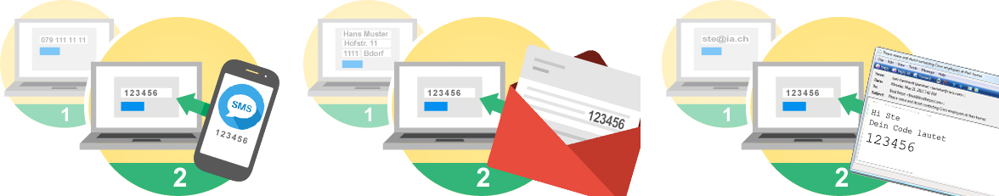
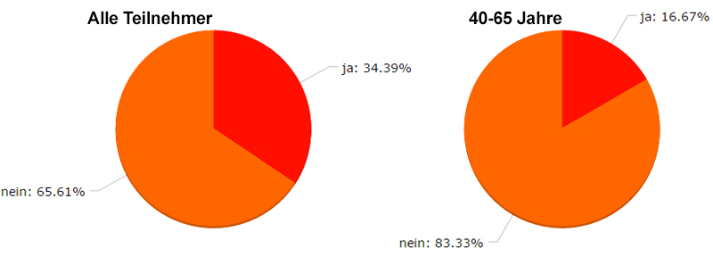
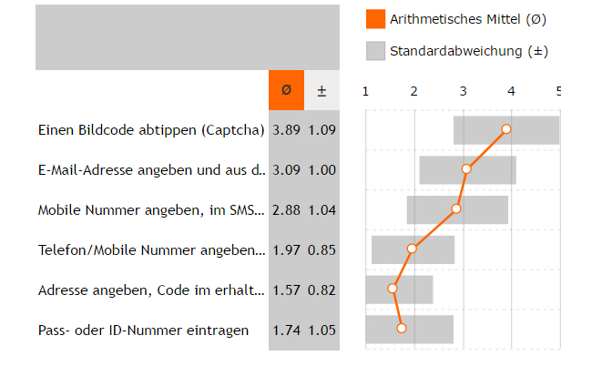

\newpage

#Studie

##Definition der Begriffe aus Aufgabenstellung
Während den Besprechungen zur Definition der Anforderungen wurde der Begriff "Geschwindigkeit" aus der Aufgabenstellung diskutiert. Der Auftraggeber versteht den Begriff der Geschwindigkeit nicht als objektiv eindeutigen Parameter Zeit sondern als eine subjektive Wahrnehmung. Dadurch kann nicht wie angenommen, einfach die Zeit die ein Umfrageteilnehmer zum Anwenden einer Authentifizieren hat, gemessen werden, sondern die Wahrnehmung muss auch erfragt werden. Während der Diskussion wurde der Begriff "Anstrengung" verwendet. Deshalb wird auch die Umfrage auf diesem eindeutigeren Begriff "Anstrengung" aufgebaut. 

##Ziel der Studie
Das Ziel ist den Programmierer bei der Konfiguration des Authentifizierungsservice mit visualisierten Kennzahlen zu unterstützen. Der Programmierer soll die Aktzeptanz der Sicherheitsstufen unter verschiedenen Bedingungen einsehen können und anderseits soll die empfundene Angstrengung der Benutzer für das Authentifizieren pro Sicherheitsstufe visualisiert werden.

##Art der Studie
Wie die Aufgabenstellung und der Auftraggeber fordert, wird eine Studie in Form einer Umfrage mit Hilfe eines digitalen Fragebogens durchgeführt. Bevor die Studie aufgebaut wird gilt es sich Vor- und Nachteile einer schriftlichen Befragungen bewusst zu machen und basierend auf diesem Wissen die Studie zu planen.

\newpage
###Vor - und Nachteile schriftlicher Fragebogen
Schriftliche Befragungen mit Fragebogen können in verschiedenen Varianten durchgeführt werden. Deshalb unterscheiden sich zwischen den Varianten gewisse Vor- und Nachteile zu persönlich-mündlichen oder telefonischen Studie. Es wird versucht, die Möglichkeiten und Grenzen mit dem grössten gemeinsamen Nenner aufzuführen. Folgende Punkte ergeben die wichtigsten Vorteile:

- Die Kosten sind geringer. Hippler [^hippler] definiert den Richtwert von einem Viertel der Kosten zu einer persönlich-mündlichen oder telfonischen Studie.
- Schriftliche Befragungen mit Fragebogen kann in einem relativ kurzen Zeitrum realisiert werden
- Dem zu Befragenden kann eine grössere Anonymität gegeben werden
- Verteilung in verschiedene Regionen einfach und zeitnah möglich. Insbesondere bei Online Umfrage.
- Einfluss von aussen gering. Zahlreiche Studien[^umfragemethodik] belegen, dass Personen welche eine Studie im Interview die Beantwortung beeinflussen
- Die Antworten der befragten sind durch die Abwesenheit des Interviewers und durch die Anonymität ehrlicher. Dieser Punkt ist wissenschaftlich jedoch noch ziemlich umstritten. Schnell bezweifelen verschiedene Psychologen und Soziologen diesen Umstand. So auch Dr. Reuband in seinem Paper "Möglichkeiten und Probleme des Einsatzes postalischer Befragungen" [^kzfss01]

Diesen Vorteilen stehen auch gewisse Nachteile gegenüber. Die folgenden Punkte erläutern die wichtigsten Nachteile die verschiedene Varianten von Fragebögen gemeinsam haben:

- Wenn eine Studie eine zu grosse Nonresponse-Rate hat, ist eine Verallgemeinerung der Resultate unzulässig. Kurz die Bachelorarbeit würde mit der Studie das Ziel verfehlen. Bei einer schriftlichen Studie kann die Ausfallquote aber nicht im Vornherein eingeschätzt werden.
- Die Datenerhebungssituation kann nicht kontrolliert oder bestimmt werden. Wo und unter welchen Umständen der Fragebogen beantwortet wird kann nicht bestimmt und höchstens erfragt werden.
- Nachfragen basierend auf Antworten können nicht spontan gestellt werden, sondern müssen im Vornherein geplant werden.
- Bestimmte Bevölkerungsteile werden durch diese Art der Studie ausgeschlossen. Zum Beispiel Analphabeten oder bei Onlineumfragen Personen mit zu wenig technischem Know-How oder Hardware.

[^hippler]: [@hippler]
[^umfragemethodik]: Studien und Erklärungen zu Fremdbestimmung durch François Höpflinger[@umfragemethodik]
[^kzfss01]: [@kzfss01]

\newpage
###Findings
Es gilt also die Vorteile der schriftlichen Fragebogen bei der Gestaltung der Studie zu nutzen. Der ausgeschlossene Bevölkerungsteil verfältscht das Ergebniss nicht, da die Zielgruppe für die Umfrage nur gerade die Personen sind, welche auch tatsächlich an einer Onlineumfrage teilnehmen können. Die Nonresponse-Rate ist ein Risiko, dass Rechnung getragen werden muss um nicht eine ungültige Studie zu erhalten. Damit die Problematik Nonresponse-Rate gering gehalten wird und eine geeignete Umgebung für die Datenerhebungssituation  vorhanden ist, gilt es sich weiter den korrekten Aufbau einer Studie zu recherchieren.

###Webapplikation für Umfrage
Basierend auf den Empfehlungen[^empfehlung-umfrageonline] der Universität St. Gallen und der Universätit Freiburg wurde das Schweizer Unternehmen enuvo GmbH mit ihrer Webapplikation umfrageonline.ch ausgewählt. Umfrageonline stellt Studenten den Funktionsumfang für Ihre Studien nach Autorisierung kostenlos zur Verfügung.

[^empfehlung-umfrageonline]: Die Universitäten sind offizielle Kunden von umfrageonline.ch

##Aufbau Gesamtkonzept
"Ein Fragebogen soll als Gesamtkomzept (Einleitung, Hauptteil, Endteil, Design, Aufmachung) betrachtet werden, in dem die Reihenfolge und die Struktur der Frage wichtige Einflussfaktoren zur Erlangung korrekter Daten sind" [^fragebogen]

In den folgenden Abschnitten wird die Theorie für die Entwicklung dieses Gesamtkonzept abgebildet.

###Einleitung
Die Einleitung soll die Befragten motivieren an der Studie teilzunehmen und allgemeine Hinweise zur Studie geben. Die folgenden Fragen wurden durch das Institut für webbasierte Kommunikation und E-Learning zusammen getragen [@fragebogen] und und für die Studie dieser Bachelorarbeit beantwortet:

####Wer wird befragt?
Mit Absprache des Auftraggebers soll die die Zielgruppe sind Schweizer oder Personen welche in der Schweiz wohnen welche Deutsch sprechen und zwischen 16 und 65 Jahre alt sind sein. Die Angabe begründete der Auftraggeber dadurch, dass sich darin die Hauptzielgruppen seiner Kunden wiederspiegelt. Die Teilnehmer sollen die technische Know-How besitzen an einer Interaktivität teilzunehmen und den Internetzugriff haben. Dieses minimale technische Know-How werden sie Beweisen indem sie an der Umfrage teilnehmen können.

####Was ist der Zweck bzw. das Ziel der Untersuchung?
Die Studie dient dem Programmierer zur richtigen Konfiguration der Authentifizierungsmethode für seinen aktuellen Verwendungszweck.

####Was passiert mit den Ergebnissen?
Die Ergebnisse werden Programmierer zum Konfigurieren der Authentifizierungsmethode zur Verfügung gestellt und in der Bachelorarbeit veröffentlicht.

####Können die Ergebnisse eingesehen werden?
Durch Veröffentlichung der Ergebnisse kann besonders Vertrauen und Wohlwollen gewonnen werden [^fragebogen1]. Deshalb soll das Kapitel Studie der Bachelorarbeit auf Wunsch den Befragten per E-Mail zugesendet werden.

####Wer führt die Befragung durch?
ZHAW Student Christian Bachmann im Auftrag der inaffect AG

####Kontakt für Support und Fragen
Christian Bachmann, bachmch3@students.zhaw.ch

####Wie viel Zeit muss der Befragte Investieren?
Eine Einschätzung der durchschnittlich benötigen Zeit und Anzahl der Fragen sollte zur Beginn der Studie genannt werden. Folgend ist das Diagramm aus der Studie von Bosnjak und Batini [^bosnjak] abgebildet. Die Erkenntnis aus der Studie zeigt, dass nicht nur unter dem Motto je kürzer desto besser gehandelt werden sollte. Die Studie ist jedoch schon 15 Jahren alt und ist deshalb differenzierter zu sehen. Die Studie der Bachelorarbeit streben einen Aufwand von 8-12 Minuten an.

[^bosnjak]: [@bosnjak]
[^fragebogen]: Zitat vom Institut für webbasierte Kommunikation und E-Learning und Gräf et al. 2001 [@fragebogen]
[^fragebogen1]: [@fragebogen]

\newpage
##Hauptteil/Fragen
Offensichtlich stellt der Hauptteil den Löwenanteil des Aufwands dar.

###Erste Frage Theorie
Die erste Frage ist nach Dillman[^Dillman] von grosser Bedeutung. Mit ihr wird Motivation und Einsatz für den ganzen Fragebogen gesetzt. Diese Frage soll als Interesse und Neugier der Befragten bewirken.

Das Institut für webbasierte Kommunikation und E-Learning hat dafür aus verschiedenen Studien die wichtigsten Kriterien für eine erfolgreiche erste Frage zusammen getragen[^fragebogen2]:
- **Einfache Formulierung**
Der Befragte versteht sofort um was es geht und glaubt daran dass er die Fragen meistern kann
- **Kurze Beantwortungszeit, keine offenen Fragen**
Ein schnelles überwinden der ersten "Hürde" motiviert den Teilnehmer
- **Angstabbauend**
Ängste wie z.b. die des nicht Beantworten können soll abgebaut werden.
- **Inhaltlich einführen**
Die Frage soll in das Thema einführen und im Idealfall Interesse und Neugier wecken
- **Keine Fragen zur Person oder zur Ihrem demographischen Eigenschaften**

Es kann Sinn machen eine "perfekte" Einstiegsfrage zu erstellen, die in der Auswertung der Ergebnisse nicht berücksichtigt wird. Sie dient lediglich die Anforderungen einzuhalten und en Teilnehmer einen positives Einstiegserlebnis zu vermitteln.

##Erste Frage 
Die 1. Frage der Studie dieser Bachelorarbeit:

Hatten Sie schon einmal das Gefühl, dass an einem Onlinewettbewerb 
gemogelt werden kann?
0 Ja 0 Nein

\newpage
##Theorie Fragen
Fragen sollen eine Funktion übernehmen. Dabei schlägt Kleber[^kleber92] folgende Klassifizierung vor:
- Übergangs- und Vorbereitungsfragen für Themenwechsel,
- Ablenkungs- und Pufferfragen zur Minderung von Ausstrahlungseffekten,
- Filterfragen zum Übergehen von eventuell irrelevanten Fragen,
- Rangier- und Konzentrationsfragen zum Auflockern langer Darstellungen,
- Motivationsfragen zur Stärkung des Selbstvertrauens und Verminderung von Hemmungen,
- Kontrollfragen als Wahrheitskontrolle der Antworten bzw. Sichtbarmachen von Widersprüchen.

Diese Klassifizierung soll helfen den Fragebogen zu gestalten.

####Frageart
Bei der Stellung der Frage sollte festgestellt werden welche Art von Frage gestellt wird. Da sich dadurch die Antwort markantlich unterscheidet.
Folgende 3 Hauptgruppen gibt es
- **Einstellungsfragen**
Dieser Fragestellung bezieht sich auf "Wunschbarkeit oder negativen bzw. Beurteilung , den Befragte mit bestimmten Statements verbinden.
- **Verhaltensfragen**
Dabei wird direkt auf das Verhalten des Befragten bezug genommen. Dabei muss beachtet werden, dass der Befragte sein Verhalten selbst beschreibt. Einerseits entspricht die Selbstwahrnehmung der Teilnehmer teilweise nicht der Realität anderseits kann die Antwort auch dem Wunschdenken des Befragten zugrunde liegen
- **Eigenschftsfragen**
Diese Fragestellung fragt nach den Eigenschaften von Personen. Vielfach sind es persönliche und demographische Daten.

####Fragetypen
Die Fragen können generell in zwei Typen unterteilt werden

__Offene Frage__    
Der Aufwand bei der Auswertung ist sehr hoch. Ungeübte Teilnehmer können unverwertbare Antworten niederschreiben. Antworten sind schwer vergleichbar Dafür Teilnehmer kann sich so ausdrücken wie er möchte. Er wird nicht durch vorgegebene Antworten beeinflusst.    

__Geschlossene Frage__	
Die geschlossene Frage kann leicht ausgewertet werden. Die Gefahr besteht, dass der Teilnehmer ratet und durch die Antworten beeinflusst wird. Der Vorbereitungsaufwand für die Frage ist hoch. Auswahlmöglichkeiten für die Antwort könnten irelevant sein.

\newpage
##Fragen über Aktzeptanz
Es wird die folgende Hypothesen verfolgt: "Die Akzeptanz von Sicherheitsstufe ist nicht beständig. Sie ist abhängig von den Bedienungen der Interkativität: Seriosität des Anbieters, Wichtigkeit der Umfrage und möglicher Verdienste bei der Teilnahme" Der Programmier soll bei der Konfiguration das Umfeld der Interaktivität kategorisieren können. Die Hauptbereiche sind aus der Aufgabenstellung entnommen. Die anderen Kategorisierungen ergeben sich aus der Thesis.

- Voting

	- einfache

	- Casting

- Wettbewerb

	- Seriöse Firma

		- Gewinn unter 200 Franken
		
		- Gewinn über 200 Franken
	
	- Unbekante Firma
	
		- Gewinn unter 200 Franken
		
		- Gewinn über 200 Franken

Aus jeder Kategorie wird in der Studie erfragt welche Sicherheitsstufen eingesetzt der Umfrageteilnehmer einsetzen würde.
Es wird pro Kategorie eine geschlossene Frage gestellt. Der Fragetyp ist Mehrfachauswahl. 
Die Fragen sind von der Klassifizierung Verhaltensfragen. Es wird abgeklärt, unter welchen Bedienungen sich der User so verhält, dass er die Sicherheitsstufe akzeptiert. Der User kann pro Kategorie die Sicherheitsstufen auswählen welche er bereit ist zu verwenden.

\newpage
##Frage Anstrengung

Die verschiedenen Sicherheitsstufen sollen für den User direkt vergleichbar beantwortet werden können. Dafür eignet sich eine Geschlossene Frage vom Type Bewertungsmatrix. Es wurden fünf Abstufungen zur Einschätzung der Anstrengung definiert. Ausserdem kann der User bei Unsicherheit keine Antwort geben. Diese Frage ist eine Einstellungsfragen. Der User gibt bewertet seine Einstellung zu den Sicherheitsstufe anhand der Anstrengung.

##Bonus "Frage", Umgehung der Absicherung
Umfrageonline.ch enthält die Sicherheitsstufe Cookie und IP-Adresse. Wobei die Sicherheitsstufe IP-Adresse standardmässig deaktiviert ist. Diese beiden Sicherheitstufen, erlauben es wie mehrfach in dieser Bachelorarbeit dokumentiert, mehrfach an einer Umfrage teilzunehmen. Die Hypothese wird aufgestellt, dass ein Teilnehmer mit genügend technischem Know-How insbesondere bei diesem Umfragethema mehrfach teilnehmen wird.  

##Weitere Fragen
Weiter werden die 3 Eigenschftsfragen gestellt. Dabei soll Alter, Geschlecht und ob es sich um einen Schweizer oder Bewohner der Schweiz handelt angegeben werden.

##Abschluss
Der Abschluss des Fragebogens kann sehr kurz gehalten werden. Folgende Elemente sollten enthalten sein:

####Dankensformel
Eine kurze Dankensformel gehört zum guten Ton und motiviert den Teilnehmer die Umfrage korrekt abzuschliessen.

####Einladung zur Kommentierung
Durch Kommentare am Schluss können Befragte dem Untersuchter Hinweise zukommen lassen die für die Auswertung und weitere Untersuchungen dienlich sind. Dieser Möglichkeit wird nach der Erfahrung von Reuband[^kzfss01] gewürdigt.

##Verständlichkeit
Als der Umfragebogen Personen mit geringem technischem Know-How vorgelegt wurde, wurde klar das die genannten Authentifizierungsmethoden nicht bekannt sind. Selbst der Begriff Authentifizieren konnte nicht erklärt werden.
Deshalb wurden die zu analysierenden Methoden erklärt und illustriert.

##Auswertung
Die Umfragedaten werden in den entworfenen Authentifizierungsservice eingespielt. Jeder Programmierer kann während dem Konfigurieren seiner Sicherheitsstufe die gewünschten Diagramme zusammenstellen. Anhand der visualisierten Daten kann er die Meinung seiner Enduser einschätzen und optimaler für den Enduser seine Konfigurationen wählen.
Damit ist das Ziel der Studie erreicht und die Möglichkeit der Auswertung erreicht.

Weiter werden noch einige Anmerkungen zu den Fragen erläutert.

###Repräsentativität
Laut Bundesamt für Statistik ist enthält die definierte Zielgruppe 3.3 Milionen Personen[^bfs]. Dies Zahl beinhaltet die Deutschweizer welche zwischen 16 und 65 Jahre alt sind.
An der Umfrage habe 176 Personen teilgenommen. Daraus lässt sich ein Konfidenzinterval von 7,4% errechnen.

n= Strichprobengrösse=176 Umfrageteilnehmer

N= Grundgesamtheit = 3.3 Milionen Menschen in der Zielgruppe

p= Stichprobenanteil bei Normalverteilung

q= 1-p (Vereinfachte Darstellung)

t= Normalverteilungsnormierung 1,96 = 95% Trefferquote

d= Gesuchter Wert, das Konfidenzintervals Fehlertoleranzwert= 7,4%

###Gemogelt an Wettbewerben
Über 65% der Befragten gehen davon aus, dass sie noch nie an einem Wettbewerb teilgenommen haben, an welchem gemogelt hätte können. Bei den 40-65 jährigen sind es sogar über 83 Prozent. Die Einstiegsfrage, welche zur Einführung ins Thema gedacht ist, zeigt überraschend ein hohes Vertrauen in Onlinewettbewerbe.

###Bonus "Frage", Umgehung der Absicherung
3 Umfrageteilnehmer konnte mit den zur Verfügung stehenden technischen Mittel als Mehrfachteilnahme registriert werden. Die Bonusfrage wurde wie angenommen gelöst. Die Thematik der Umfrage bewegt die Teilnehmer offensichtlich zum Ausprobieren. 1 Teilnehmer brauchte nach Ende seiner 1. Teilnahme genau 17 Sekunden bis er erneut mit der Umfrage starten konnte.

##Anstrengung
Auf einer 5 stufigen Skala sind die Sicherheitsstufen nach Anstrengung bewertet: 1 Punkt für sehr anstrengend, 5 Punkte für sehr angenehm.
Anhand dieser Punkte konnte nun ein arithmetisches Mittel errechnet werden.
Das empfinden der Anstrengung ist bei allen Teilnehmer ähnlich feststellbar und mit einer Standartabweichung von 0.85 bis 1.1 Punkte festgelegt. Dabei ist feststellbar, dass unser Authentifizierungsservice Sicherheitsstufen mit angenehmem empfinden bis Sicherheitsstufen mit sehr anstrengendem empfinden zur Verfügung stellt. Die gewünschte Breite des Arbeitgebers konnte auch in diesem Aspekt gefunden werden.

##Aktzeptanz
Die Hypothese, dass die Aktzeptanz zum Einsatz von Sicherheitsstufen mit Seriösität des Anbieters, Wichtigkeit und möglichen Verdienst verändert zeigt das Umfrageergebnis in allen Altersstufen. 
Interessant ist, dass die Akzeptanz von einem automatischen Telefonanruf geringer ist wie die Aktzeptanz einer SMS von einer Mobilennumer. Diese Erkenntnis kann auf alle Fragen angewendet werden, ist also unabhängig von Bedienungen der Interaktivitäten. Die Angabe seiner eigenen Mobilenummer wird dem mühsamen abtippen des Anrufes auf ein mögliches Fixnettelefon vorgezogen.
Der Pass oder die ID-Nummer wird nur bei einem vertrauenswürdigen Unternehmen angegeben. Der zu erhoffende Gewinn hat keinen bedeutenden Einfluss.
Bei unbekannten Unternehmen als Anbieter, würden die grosse Mehrheit der Teilnehmer ausser Captcha und E-Mail-Adresse keine Sicherheitsstufe verwenden. Keine andere Sicherheitsstufe konnte bei diesem Anbieter bei mehr als einem 1/5 der Teilnehmer Akzeptanz erhalten.
Der grosse Unterschied bei den Ergebnissen macht nicht der mögliche Verdienst oder die Wichtigkeit des Resultats. Vielmehr ist es der Anbieter und das Vertrauen das der Endbenutzer diesem geben kann.

[^bfs]: [@bfs]

[^Dillman]: [@dillman]
[^kleber92]: [@kleber92]
[^fragebogen2]: [@fragebogen]
